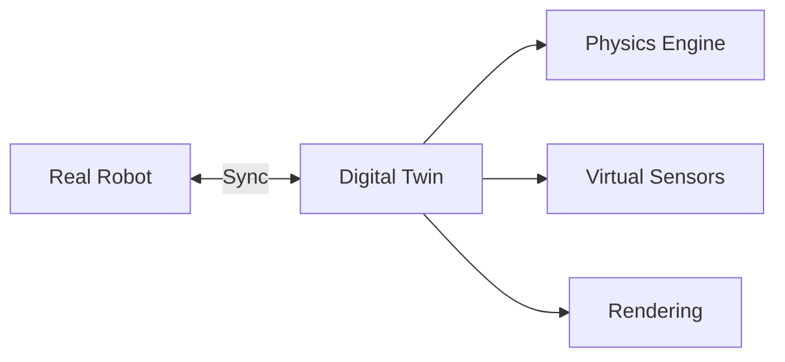

# The Power of Digital Twins

A digital twin is not just a 3D model—it's a **parallel universe** where your robot can fail safely and learn infinitely.

<!-- truncate -->

## What is a Digital Twin?



A digital twin mirrors your physical robot in simulation, enabling:

- **Safe testing** — Crash without consequences
- **Rapid iteration** — Test thousands of scenarios in minutes
- **Edge cases** — Simulate rare events (fires, crowds)
- **Synthetic data** — Generate training data at scale

## Simulation Stack Comparison

| Simulator | Physics | Use Case |
|-----------|---------|----------|
| **Gazebo** | DART/Bullet | Open-source, ROS integration |
| **Unity** | PhysX | High-fidelity rendering, HRI |
| **Isaac Sim** | PhysX | Domain randomization, synthetic data |

## Getting Started with Gazebo

```bash
# Install Gazebo Fortress
sudo apt install ros-humble-ros-gz

# Launch empty world
ros2 launch ros_gz_sim gz_sim.launch.py
```

## Learn More

Dive deeper in [Module 2: The Digital Twin](/docs/digital-twin/) where we build complete simulation environments with physics, sensors, and ROS 2 integration.

---

*Simulate first, deploy second.*
