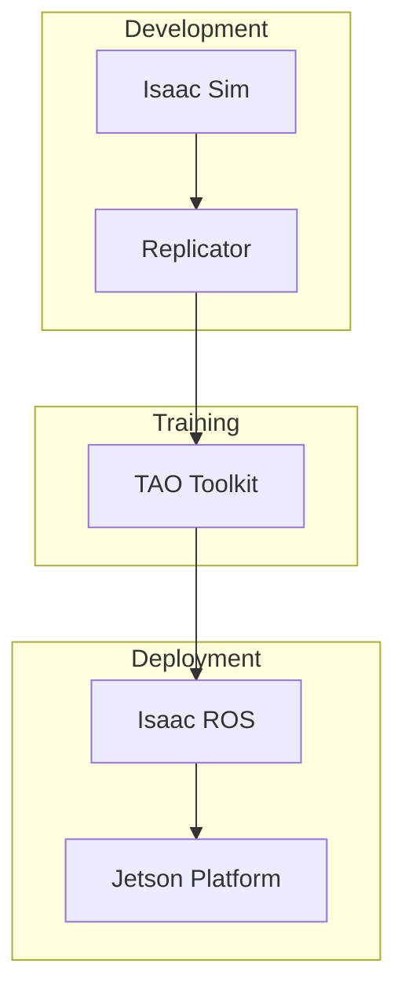

# Accelerating Robotics AI with NVIDIA Isaac

**NVIDIA Isaac** is a comprehensive platform for developing, simulating, and deploying AI-powered robots. Let's explore why it's becoming essential for humanoid robotics.

<!-- truncate -->

## The Isaac Ecosystem



## Key Components

### 1. Isaac Sim
Photorealistic simulation with PhysX physics. Perfect for:
- Testing manipulation tasks
- Training perception models
- Validating navigation algorithms

### 2. Isaac ROS
GPU-accelerated ROS 2 packages:
- **VSLAM** — Visual Simultaneous Localization and Mapping
- **AprilTag detection** — Fiducial marker tracking
- **DNN inference** — Real-time neural network inference

### 3. Replicator
Synthetic data generation for training:
```python
import omni.replicator.core as rep

with rep.new_layer():
    camera = rep.create.camera(position=(0, 0, 5))
    rep.randomizer.rotation(camera)
    
    writer = rep.WriterRegistry.get("BasicWriter")
    writer.initialize(output_dir="./output")
```

## Hardware Requirements

:::danger GPU Required
Isaac Sim requires a powerful GPU:
- **Minimum**: RTX 3070 (8GB VRAM)
- **Recommended**: RTX 4080+ (16GB+ VRAM)
:::

## Learn More

Master Isaac in [Module 3: The AI-Robot Brain](/docs/ai-robot-brain/) where we implement Visual SLAM and Nav2 navigation.

---

*Build smarter robots with GPU acceleration.*
