# VLA Models: Where AI Meets Physical Action

**Vision-Language-Action (VLA)** models represent the frontier of robotics—systems that see the world, understand natural language, and take physical action.

<!-- truncate -->

## The VLA Revolution

```mermaid
graph LR
    subgraph "VLA Pipeline"
        VOICE[🎤 Voice] --> ASR[Speech Recognition]
        ASR --> LLM[🧠 Language Model]
        VISION[📷 Vision] --> VLM[Vision-Language Model]
        VLM --> LLM
        LLM --> PLANNER[Task Planner]
        PLANNER --> ROS[ROS 2 Actions]
        ROS --> ROBOT[🤖 Robot]
    end
```



## Key Technologies

| Component | Technology | Function |
|-----------|------------|----------|
| **Vision** | ViT, CLIP, GPT-4V | Scene understanding |
| **Language** | GPT-4, Claude, LLaMA | Intent parsing, planning |
| **Action** | ROS 2, MoveIt, Nav2 | Physical execution |

## Why VLA Matters

Traditional robotics required:
1. Hand-coded behaviors
2. Explicit programming for each task
3. Predefined action sequences

VLA enables:
1. **Natural language commands** — "Go to the kitchen and get me a cup"
2. **Contextual understanding** — Robot interprets intent, not just keywords
3. **Adaptive behavior** — Handles novel situations

## Building a VLA System

```python
# Simplified VLA pipeline
def process_command(voice_input, camera_image):
    # 1. Speech to text
    text = whisper.transcribe(voice_input)
    
    # 2. Vision understanding
    scene = vision_model.describe(camera_image)
    
    # 3. LLM planning
    actions = llm.plan(
        command=text,
        scene_context=scene,
        robot_capabilities=ROBOT_SKILLS
    )
    
    # 4. Execute actions
    for action in actions:
        robot.execute(action)
```

## The Capstone Project

In [Module 4: Vision-Language-Action](/docs/vision-language-action/), you'll build a complete autonomous humanoid that:

1. 🎤 Listens to voice commands
2. 🧠 Plans actions using an LLM
3. 🗺️ Navigates autonomously
4. 📷 Identifies objects with vision
5. 🤖 Executes physical manipulation
6. 🔊 Confirms actions verbally

---

*The ultimate goal: a robot that sees the world, understands your words, and acts with purpose.*

[Start the Capstone →](/docs/vision-language-action/capstone)
