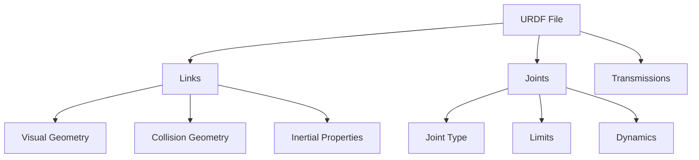

# 1.3 Anatomy of a Humanoid (URDF)

> *"URDF is the DNA of your robot—it defines every joint, link, and physical property."*

---

## 🎯 Learning Objectives

- Understand URDF structure and components
- Define links with visual and collision geometry
- Configure joints with limits and dynamics
- Create a complete bipedal humanoid model

---

## What is URDF?

**URDF** (Unified Robot Description Format) is an XML-based format for describing robot models:



---

## URDF Building Blocks

### 1. Links

A **link** represents a rigid body:

```xml
<link name="base_link">
  <!-- Visual: What you see -->
  <visual>
    <origin xyz="0 0 0.1" rpy="0 0 0"/>
    <geometry>
      <box size="0.3 0.2 0.2"/>
    </geometry>
    <material name="blue">
      <color rgba="0.2 0.4 0.8 1.0"/>
    </material>
  </visual>
  
  <!-- Collision: For physics simulation -->
  <collision>
    <origin xyz="0 0 0.1" rpy="0 0 0"/>
    <geometry>
      <box size="0.3 0.2 0.2"/>
    </geometry>
  </collision>
  
  <!-- Inertial: Mass and inertia tensor -->
  <inertial>
    <origin xyz="0 0 0.1" rpy="0 0 0"/>
    <mass value="5.0"/>
    <inertia ixx="0.05" ixy="0" ixz="0" 
             iyy="0.05" iyz="0" 
             izz="0.05"/>
  </inertial>
</link>
```

:::danger Inertial Properties
Always define realistic inertial properties! Incorrect inertia values cause unstable physics simulation. Use CAD software or calculate from geometry.
:::

---

### 2. Joints

A **joint** connects two links:

```xml
<!-- Revolute joint (rotational) -->
<joint name="hip_pitch" type="revolute">
  <parent link="torso"/>
  <child link="upper_leg"/>
  <origin xyz="0 -0.1 -0.2" rpy="0 0 0"/>
  <axis xyz="0 1 0"/>  <!-- Rotation around Y-axis -->
  <limit lower="-1.57" upper="1.57" 
         effort="100" velocity="2.0"/>
  <dynamics damping="0.1" friction="0.05"/>
</joint>

<!-- Fixed joint (no movement) -->
<joint name="head_mount" type="fixed">
  <parent link="torso"/>
  <child link="head"/>
  <origin xyz="0 0 0.4" rpy="0 0 0"/>
</joint>

<!-- Continuous joint (unlimited rotation) -->
<joint name="wheel" type="continuous">
  <parent link="chassis"/>
  <child link="wheel_link"/>
  <origin xyz="0.2 0 0"/>
  <axis xyz="0 1 0"/>
</joint>
```

**Joint Types:**

| Type | Description | Example |
|------|-------------|---------|
| `revolute` | Rotation with limits | Elbow, knee |
| `continuous` | Unlimited rotation | Wheels |
| `prismatic` | Linear sliding | Telescope arm |
| `fixed` | No movement | Sensor mount |
| `floating` | 6-DOF (root only) | Base of mobile robot |
| `planar` | 2D movement | Drawer slide |

---

## 🚀 Deliverable: Bipedal URDF Model

Complete humanoid model with torso, legs, and arms:

```xml
<?xml version="1.0"?>
<robot name="pai_humanoid" xmlns:xacro="http://www.ros.org/wiki/xacro">
  
  <!-- ================= MATERIALS ================= -->
  <material name="white">
    <color rgba="0.9 0.9 0.9 1.0"/>
  </material>
  <material name="blue">
    <color rgba="0.2 0.4 0.8 1.0"/>
  </material>
  <material name="dark_gray">
    <color rgba="0.3 0.3 0.3 1.0"/>
  </material>
  
  <!-- ================= TORSO ================= -->
  <link name="base_link">
    <visual>
      <origin xyz="0 0 0" rpy="0 0 0"/>
      <geometry>
        <box size="0.3 0.2 0.4"/>
      </geometry>
      <material name="blue"/>
    </visual>
    <collision>
      <origin xyz="0 0 0" rpy="0 0 0"/>
      <geometry>
        <box size="0.3 0.2 0.4"/>
      </geometry>
    </collision>
    <inertial>
      <mass value="10.0"/>
      <inertia ixx="0.2" ixy="0" ixz="0" 
               iyy="0.15" iyz="0" izz="0.1"/>
    </inertial>
  </link>
  
  <!-- ================= HEAD ================= -->
  <link name="head">
    <visual>
      <origin xyz="0 0 0.1" rpy="0 0 0"/>
      <geometry>
        <sphere radius="0.12"/>
      </geometry>
      <material name="white"/>
    </visual>
    <collision>
      <geometry>
        <sphere radius="0.12"/>
      </geometry>
    </collision>
    <inertial>
      <mass value="2.0"/>
      <inertia ixx="0.01" ixy="0" ixz="0" 
               iyy="0.01" iyz="0" izz="0.01"/>
    </inertial>
  </link>
  
  <joint name="head_joint" type="fixed">
    <parent link="base_link"/>
    <child link="head"/>
    <origin xyz="0 0 0.25" rpy="0 0 0"/>
  </joint>
  
  <!-- ================= RIGHT LEG ================= -->
  
  <!-- Upper Leg -->
  <link name="r_upper_leg">
    <visual>
      <origin xyz="0 0 -0.15" rpy="0 0 0"/>
      <geometry>
        <cylinder radius="0.05" length="0.3"/>
      </geometry>
      <material name="dark_gray"/>
    </visual>
    <collision>
      <origin xyz="0 0 -0.15"/>
      <geometry>
        <cylinder radius="0.05" length="0.3"/>
      </geometry>
    </collision>
    <inertial>
      <mass value="3.0"/>
      <inertia ixx="0.03" ixy="0" ixz="0" 
               iyy="0.03" iyz="0" izz="0.005"/>
    </inertial>
  </link>
  
  <joint name="r_hip_pitch" type="revolute">
    <parent link="base_link"/>
    <child link="r_upper_leg"/>
    <origin xyz="0 -0.1 -0.2" rpy="0 0 0"/>
    <axis xyz="0 1 0"/>
    <limit lower="-1.57" upper="0.5" effort="150" velocity="3.0"/>
    <dynamics damping="0.5" friction="0.1"/>
  </joint>
  
  <!-- Lower Leg -->
  <link name="r_lower_leg">
    <visual>
      <origin xyz="0 0 -0.15" rpy="0 0 0"/>
      <geometry>
        <cylinder radius="0.04" length="0.3"/>
      </geometry>
      <material name="dark_gray"/>
    </visual>
    <collision>
      <origin xyz="0 0 -0.15"/>
      <geometry>
        <cylinder radius="0.04" length="0.3"/>
      </geometry>
    </collision>
    <inertial>
      <mass value="2.0"/>
      <inertia ixx="0.02" ixy="0" ixz="0" 
               iyy="0.02" iyz="0" izz="0.003"/>
    </inertial>
  </link>
  
  <joint name="r_knee" type="revolute">
    <parent link="r_upper_leg"/>
    <child link="r_lower_leg"/>
    <origin xyz="0 0 -0.3" rpy="0 0 0"/>
    <axis xyz="0 1 0"/>
    <limit lower="0" upper="2.5" effort="100" velocity="4.0"/>
    <dynamics damping="0.3" friction="0.1"/>
  </joint>
  
  <!-- Foot -->
  <link name="r_foot">
    <visual>
      <origin xyz="0.03 0 0" rpy="0 0 0"/>
      <geometry>
        <box size="0.15 0.08 0.03"/>
      </geometry>
      <material name="white"/>
    </visual>
    <collision>
      <geometry>
        <box size="0.15 0.08 0.03"/>
      </geometry>
    </collision>
    <inertial>
      <mass value="0.5"/>
      <inertia ixx="0.001" ixy="0" ixz="0" 
               iyy="0.001" iyz="0" izz="0.001"/>
    </inertial>
  </link>
  
  <joint name="r_ankle" type="revolute">
    <parent link="r_lower_leg"/>
    <child link="r_foot"/>
    <origin xyz="0 0 -0.3" rpy="0 0 0"/>
    <axis xyz="0 1 0"/>
    <limit lower="-0.8" upper="0.8" effort="50" velocity="3.0"/>
    <dynamics damping="0.2" friction="0.1"/>
  </joint>
  
  <!-- ================= LEFT LEG ================= -->
  <!-- (Mirror of right leg with positive Y offsets) -->
  
  <link name="l_upper_leg">
    <visual>
      <origin xyz="0 0 -0.15"/>
      <geometry><cylinder radius="0.05" length="0.3"/></geometry>
      <material name="dark_gray"/>
    </visual>
    <collision><geometry><cylinder radius="0.05" length="0.3"/></geometry></collision>
    <inertial><mass value="3.0"/><inertia ixx="0.03" ixy="0" ixz="0" iyy="0.03" iyz="0" izz="0.005"/></inertial>
  </link>
  
  <joint name="l_hip_pitch" type="revolute">
    <parent link="base_link"/>
    <child link="l_upper_leg"/>
    <origin xyz="0 0.1 -0.2"/>
    <axis xyz="0 1 0"/>
    <limit lower="-1.57" upper="0.5" effort="150" velocity="3.0"/>
  </joint>
  
  <link name="l_lower_leg">
    <visual><origin xyz="0 0 -0.15"/><geometry><cylinder radius="0.04" length="0.3"/></geometry><material name="dark_gray"/></visual>
    <collision><geometry><cylinder radius="0.04" length="0.3"/></geometry></collision>
    <inertial><mass value="2.0"/><inertia ixx="0.02" ixy="0" ixz="0" iyy="0.02" iyz="0" izz="0.003"/></inertial>
  </link>
  
  <joint name="l_knee" type="revolute">
    <parent link="l_upper_leg"/>
    <child link="l_lower_leg"/>
    <origin xyz="0 0 -0.3"/>
    <axis xyz="0 1 0"/>
    <limit lower="0" upper="2.5" effort="100" velocity="4.0"/>
  </joint>
  
  <link name="l_foot">
    <visual><origin xyz="0.03 0 0"/><geometry><box size="0.15 0.08 0.03"/></geometry><material name="white"/></visual>
    <collision><geometry><box size="0.15 0.08 0.03"/></geometry></collision>
    <inertial><mass value="0.5"/><inertia ixx="0.001" ixy="0" ixz="0" iyy="0.001" iyz="0" izz="0.001"/></inertial>
  </link>
  
  <joint name="l_ankle" type="revolute">
    <parent link="l_lower_leg"/>
    <child link="l_foot"/>
    <origin xyz="0 0 -0.3"/>
    <axis xyz="0 1 0"/>
    <limit lower="-0.8" upper="0.8" effort="50" velocity="3.0"/>
  </joint>
  
</robot>
```

---

## Visualizing Your Robot

```bash
# Install visualization tools
sudo apt install ros-humble-urdf-tutorial

# Check URDF for errors
check_urdf pai_humanoid.urdf

# View in RViz
ros2 launch urdf_tutorial display.launch.py model:=pai_humanoid.urdf
```

---

## 📝 Exercises

### Exercise 1.3.1: Add Arms
Extend the URDF to include left and right arms with shoulder, elbow, and wrist joints.

### Exercise 1.3.2: Add Sensors
Add a camera link to the head and a LiDAR link to the torso.

### Exercise 1.3.3: Use Xacro
Convert the URDF to Xacro format using macros for repeated leg/arm definitions.

---

<div style={{textAlign: 'center', marginTop: '2rem'}}>

[← Previous: Python Bridging](./python-bridging.md) | [Next: Module 2 - Digital Twin →](../02-digital-twin/index.md)

</div>
