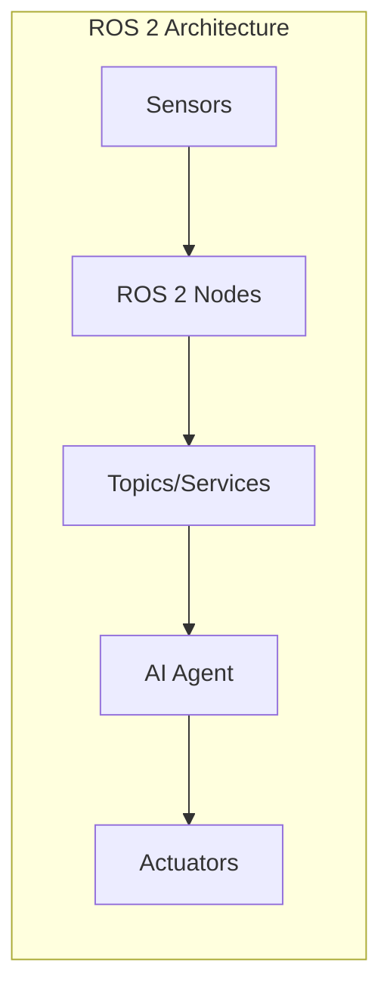
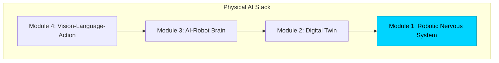

# Module 1: The Robotic Nervous System

> *"ROS 2 is to robotics what the nervous system is to the human body—the communication backbone that connects perception to action."*

---



---

## 🎯 Module Objectives

By the end of this module, you will be able to:

- **Understand** ROS 2 architecture: Nodes, Topics, Services, and Actions
- **Implement** Python bridges using `rclpy` to connect AI agents with hardware
- **Create** robot descriptions using URDF (Unified Robot Description Format)
- **Build** a functional "Hello Robot" node and basic bipedal URDF model

---

## 📚 Chapter Overview

| Chapter | Topic | Deliverable |
|---------|-------|-------------|
| 1.1 | [ROS 2 Fundamentals](./ros2-fundamentals.md) | Understanding the architecture |
| 1.2 | [Python Bridging with rclpy](./python-bridging.md) | Your first ROS 2 node |
| 1.3 | [Anatomy of a Humanoid (URDF)](./humanoid-urdf.md) | Bipedal robot model |

---

## 🛠️ Prerequisites

Before starting this module, ensure you have:

```bash
# Ubuntu 22.04 or Windows with WSL2
# ROS 2 Humble installed
sudo apt update
sudo apt install ros-humble-desktop

# Source ROS 2
source /opt/ros/humble/setup.bash

# Verify installation
ros2 --version
```

:::tip ROS 2 on Windows
For Windows users, we recommend using **WSL2** with Ubuntu 22.04 for the best ROS 2 experience. Alternatively, use Docker containers.
:::

---

## 🏗️ Module Architecture

This module builds the foundation layer of your Physical AI stack:



---

## 📦 Deliverables

By completing this module, you will have created:

1. **Hello Robot Node** - A functional ROS 2 node that publishes messages
2. **Bipedal URDF Model** - A complete robot description for simulation
3. **Launch Files** - Automated startup configurations

---

## 📥 Code Downloads

Download the complete code examples for this module:

import CodeDownloads from '@site/src/components/CodeDownloads';

<CodeDownloads
    module={1}
    files={[
        { filename: 'hello_robot.py', description: 'ROS 2 publisher node example' },
        { filename: 'bipedal_robot.urdf', description: 'Complete humanoid URDF model' },
        { filename: 'robot_launch.py', description: 'Launch file configuration' }
    ]}
/>

---

<div style={{textAlign: 'center', marginTop: '2rem'}}>

[Start Chapter 1.1: ROS 2 Fundamentals →](./ros2-fundamentals.md)

</div>

