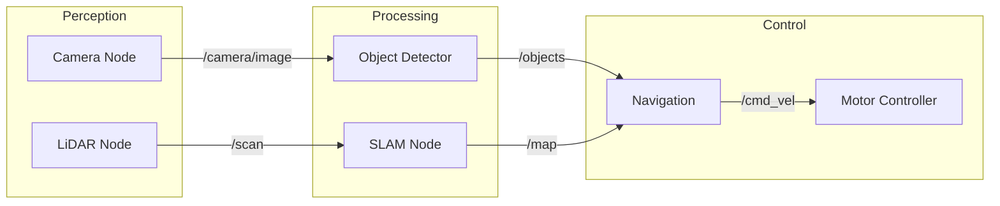
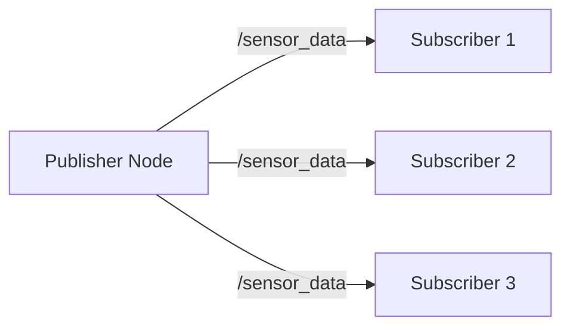
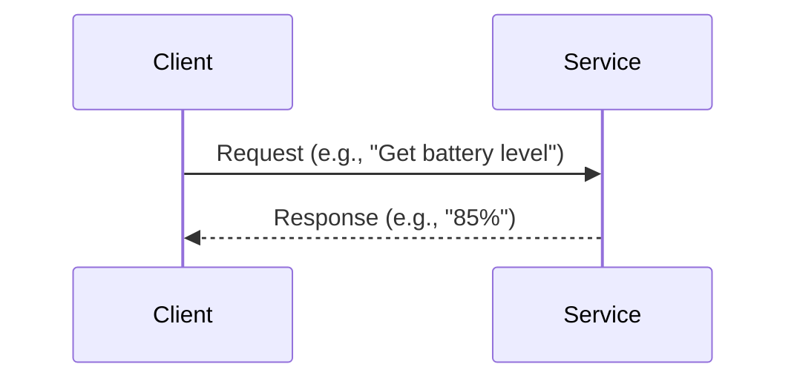
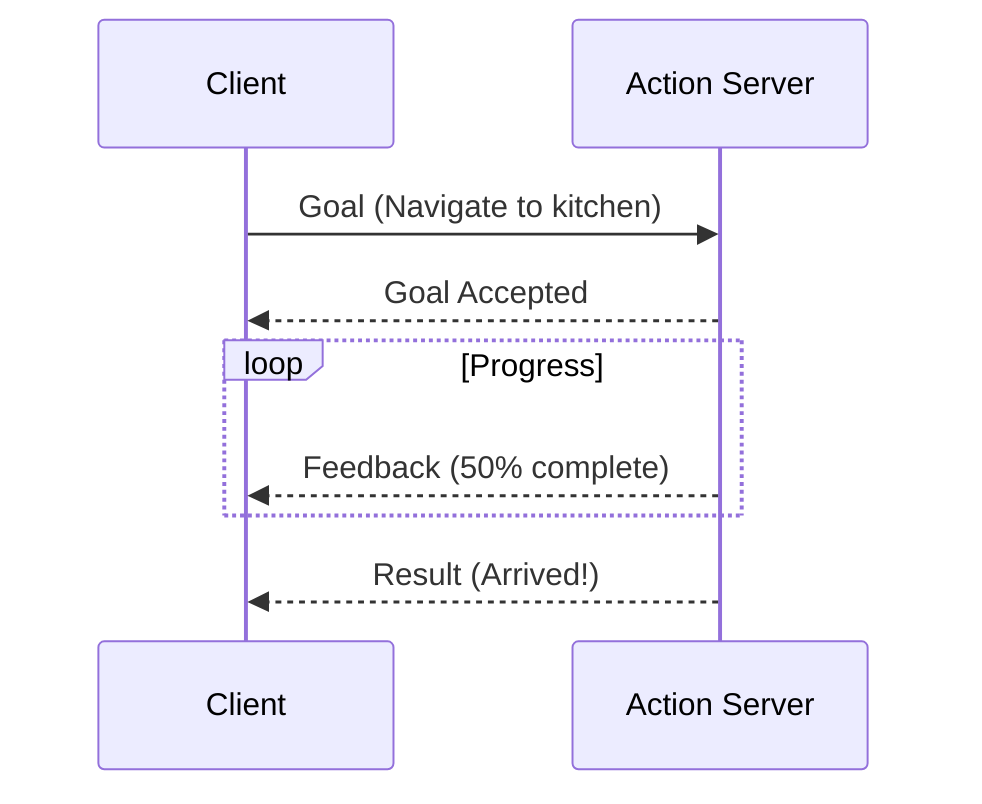

# 1.1 ROS 2 Fundamentals

> *"Understanding ROS 2's communication patterns is the key to building robust robot systems."*

---

## 🎯 Learning Objectives

- Understand the ROS 2 computation graph
- Differentiate between Topics, Services, and Actions
- Explain the DDS middleware layer
- Visualize node communication with `rqt_graph`

---

## The ROS 2 Computation Graph

ROS 2 organizes robot software as a **graph** of communicating nodes:



---

## Core Concepts

### 1. Nodes

A **node** is a single-purpose process that performs computation.

```python
import rclpy
from rclpy.node import Node

class MinimalNode(Node):
    def __init__(self):
        super().__init__('minimal_node')
        self.get_logger().info('Hello from ROS 2!')

def main():
    rclpy.init()
    node = MinimalNode()
    rclpy.spin(node)
    node.destroy_node()
    rclpy.shutdown()

if __name__ == '__main__':
    main()
```

:::tip Node Naming
Node names must be unique within the ROS 2 graph. Use descriptive names like `camera_driver`, `path_planner`, or `arm_controller`.
:::

---

### 2. Topics (Publish-Subscribe)

**Topics** enable one-to-many asynchronous communication:



**Publisher Example:**

```python
from std_msgs.msg import String

class PublisherNode(Node):
    def __init__(self):
        super().__init__('publisher_node')
        self.publisher = self.create_publisher(String, 'robot_status', 10)
        self.timer = self.create_timer(1.0, self.publish_status)
    
    def publish_status(self):
        msg = String()
        msg.data = 'Robot is operational'
        self.publisher.publish(msg)
        self.get_logger().info(f'Published: {msg.data}')
```

**Subscriber Example:**

```python
class SubscriberNode(Node):
    def __init__(self):
        super().__init__('subscriber_node')
        self.subscription = self.create_subscription(
            String,
            'robot_status',
            self.status_callback,
            10
        )
    
    def status_callback(self, msg):
        self.get_logger().info(f'Received: {msg.data}')
```

---

### 3. Services (Request-Response)

**Services** provide synchronous RPC-style communication:



**Service Definition** (`srv/GetBatteryLevel.srv`):

```
# Request
---
# Response
float32 battery_percentage
string status
```

**Service Server:**

```python
from my_robot_interfaces.srv import GetBatteryLevel

class BatteryService(Node):
    def __init__(self):
        super().__init__('battery_service')
        self.srv = self.create_service(
            GetBatteryLevel,
            'get_battery_level',
            self.get_battery_callback
        )
        self.battery_level = 85.0
    
    def get_battery_callback(self, request, response):
        response.battery_percentage = self.battery_level
        response.status = 'OK' if self.battery_level > 20 else 'LOW'
        return response
```

---

### 4. Actions (Long-Running Tasks)

**Actions** handle tasks that take time and provide feedback:



**Action Definition** (`action/Navigate.action`):

```
# Goal
geometry_msgs/PoseStamped target_pose
---
# Result
bool success
string message
---
# Feedback
float32 distance_remaining
float32 estimated_time
```

:::danger Action Preemption
Actions can be **canceled** mid-execution. Always implement proper cleanup in your action servers to handle preemption safely!
:::

---

## Communication Comparison

| Type | Pattern | Use Case | Blocking? |
|------|---------|----------|-----------|
| **Topic** | Pub-Sub | Sensor streams, status updates | No |
| **Service** | Request-Reply | Quick queries, configuration | Yes |
| **Action** | Goal-Feedback-Result | Navigation, manipulation | No |

---

## Quality of Service (QoS)

ROS 2 uses **DDS** (Data Distribution Service) with configurable QoS:

```python
from rclpy.qos import QoSProfile, ReliabilityPolicy, HistoryPolicy

# For sensor data (best effort, might drop messages)
sensor_qos = QoSProfile(
    reliability=ReliabilityPolicy.BEST_EFFORT,
    history=HistoryPolicy.KEEP_LAST,
    depth=10
)

# For critical commands (reliable delivery)
command_qos = QoSProfile(
    reliability=ReliabilityPolicy.RELIABLE,
    history=HistoryPolicy.KEEP_ALL,
    depth=100
)
```

---

## Hands-On: Visualizing the Graph

```bash
# Terminal 1: Run your nodes
ros2 run my_package my_node

# Terminal 2: Visualize the graph
ros2 run rqt_graph rqt_graph

# List all topics
ros2 topic list

# Echo a topic
ros2 topic echo /robot_status

# List all services
ros2 service list
```

---

## 📝 Exercises

### Exercise 1.1.1: Topic Communication
Create two nodes:
1. A **temperature_publisher** that publishes simulated temperature readings
2. A **temperature_monitor** that subscribes and logs warnings above 50°C

### Exercise 1.1.2: Service Implementation
Create a service that accepts a robot joint name and returns its current angle.

### Exercise 1.1.3: Graph Analysis
Run `rqt_graph` with the `turtlesim` package and identify all nodes and topics.

---

<div style={{textAlign: 'center', marginTop: '2rem'}}>

[← Back to Module 1](./index.md) | [Next: Python Bridging with rclpy →](./python-bridging.md)

</div>
