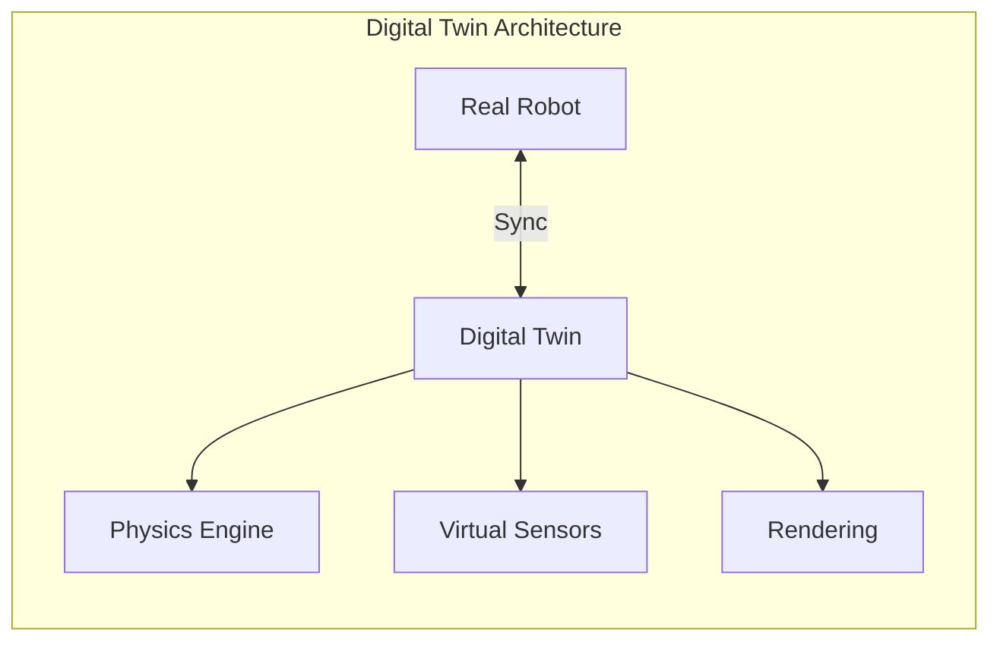
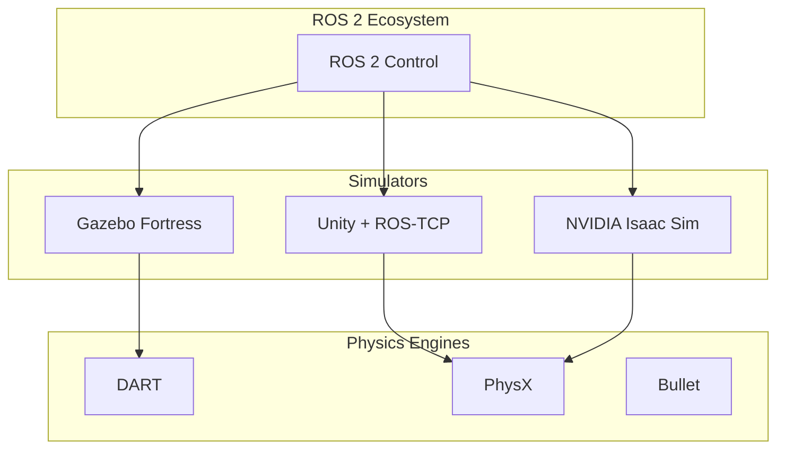

# Module 2: The Digital Twin

> *"A digital twin is not just a model—it's a parallel universe where your robot can fail safely and learn infinitely."*

---

---

## Module Objectives

By the end of this module, you will be able to:

- **Configure** physics engines: gravity, friction, and collision in Gazebo
- **Build** high-fidelity environments in Unity for human-robot interaction
- **Simulate** sensors: LiDAR point clouds, depth cameras, and IMU data streams
- **Create** a simulation where a robot senses walls and obstacles

---

## Chapter Overview

| Chapter | Topic | Deliverable |
|---------|-------|-------------|
| 2.1 | [Physics Engines (Gazebo)](./physics-engines.md) | World with gravity & friction |
| 2.2 | [Rendering & HRI (Unity)](./unity-rendering.md) | Interactive environment |
| 2.3 | [Sensor Simulation](./sensor-simulation.md) | LiDAR, depth camera, IMU |

---

## Why Digital Twins?

| Benefit | Description |
|---------|-------------|
| **Safe Testing** | Crash robots virtually without damage |
| **Rapid Iteration** | Test thousands of scenarios in minutes |
| **Edge Cases** | Simulate rare events (fires, crowds) |
| **Data Generation** | Create synthetic training data |
| **Remote Development** | Develop without physical hardware |

---

## Simulation Stack

---

## Deliverables

By completing this module, you will have:

1. **Gazebo World** - Environment with physics-accurate obstacles
2. **Sensor Suite** - Simulated LiDAR, camera, and IMU
3. **Obstacle Sensing Demo** - Robot detecting and avoiding walls

---

## Code Downloads

Download the complete code examples for this module:

import CodeDownloads from '@site/src/components/CodeDownloads';

<CodeDownloads
    module={2}
    files={[
        { filename: 'physics_config.yaml', description: 'Gazebo physics parameters' },
        { filename: 'sensor_bridge.py', description: 'ROS-Gazebo sensor bridge' },
        { filename: 'warehouse_world.sdf', description: 'Complete warehouse simulation world' }
    ]}
/>

---

[Start Chapter 2.1: Physics Engines →](./physics-engines.md)

