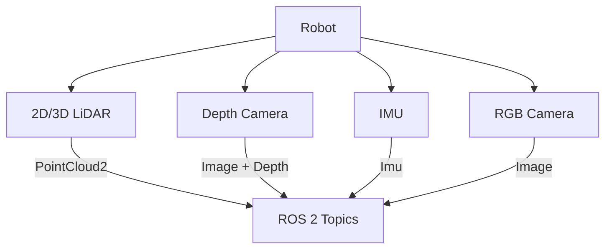

# 2.3 Sensor Simulation

> *"Virtual sensors must be imperfect—because real sensors are. Add noise to add realism."*

---

## 🎯 Learning Objectives

- Implement LiDAR point cloud generation in Gazebo
- Configure depth cameras with realistic parameters
- Simulate IMU data with noise models
- Create the obstacle-sensing robot deliverable

---

## Sensor Overview



---

## 1. LiDAR Simulation

### 2D LiDAR (for navigation)

```xml
<!-- Add to your robot URDF/SDF -->
<link name="lidar_link">
  <visual>
    <geometry><cylinder><radius>0.05</radius><length>0.04</length></cylinder></geometry>
  </visual>
</link>

<joint name="lidar_joint" type="fixed">
  <parent link="base_link"/>
  <child link="lidar_link"/>
  <origin xyz="0 0 0.3" rpy="0 0 0"/>
</joint>

<!-- Gazebo sensor plugin -->
<gazebo reference="lidar_link">
  <sensor name="lidar" type="gpu_lidar">
    <topic>/scan</topic>
    <update_rate>10</update_rate>
    <lidar>
      <scan>
        <horizontal>
          <samples>360</samples>
          <resolution>1</resolution>
          <min_angle>-3.14159</min_angle>
          <max_angle>3.14159</max_angle>
        </horizontal>
      </scan>
      <range>
        <min>0.1</min>
        <max>10.0</max>
        <resolution>0.01</resolution>
      </range>
      <noise>
        <type>gaussian</type>
        <mean>0.0</mean>
        <stddev>0.01</stddev>
      </noise>
    </lidar>
    <always_on>true</always_on>
    <visualize>true</visualize>
  </sensor>
</gazebo>
```

### 3D LiDAR (for mapping)

```xml
<gazebo reference="lidar_3d_link">
  <sensor name="lidar_3d" type="gpu_lidar">
    <topic>/points</topic>
    <update_rate>10</update_rate>
    <lidar>
      <scan>
        <horizontal>
          <samples>1800</samples>
          <min_angle>-3.14159</min_angle>
          <max_angle>3.14159</max_angle>
        </horizontal>
        <vertical>
          <samples>16</samples>
          <min_angle>-0.26</min_angle>
          <max_angle>0.26</max_angle>
        </vertical>
      </scan>
      <range>
        <min>0.3</min>
        <max>100.0</max>
      </range>
    </lidar>
  </sensor>
</gazebo>
```

---

## 2. Depth Camera

```xml
<gazebo reference="camera_link">
  <sensor name="rgbd_camera" type="rgbd_camera">
    <topic>/camera</topic>
    <update_rate>30</update_rate>
    
    <camera>
      <horizontal_fov>1.047</horizontal_fov>
      <image>
        <width>640</width>
        <height>480</height>
        <format>R8G8B8</format>
      </image>
      <clip>
        <near>0.1</near>
        <far>10.0</far>
      </clip>
      <depth_camera>
        <clip>
          <near>0.3</near>
          <far>5.0</far>
        </clip>
      </depth_camera>
      <noise>
        <type>gaussian</type>
        <mean>0.0</mean>
        <stddev>0.007</stddev>
      </noise>
    </camera>
    
    <always_on>true</always_on>
    <visualize>true</visualize>
  </sensor>
</gazebo>
```

---

## 3. IMU Sensor

```xml
<gazebo reference="imu_link">
  <sensor name="imu" type="imu">
    <topic>/imu/data</topic>
    <update_rate>100</update_rate>
    
    <imu>
      <angular_velocity>
        <x>
          <noise type="gaussian">
            <mean>0.0</mean>
            <stddev>0.0002</stddev>
          </noise>
        </x>
        <y><noise type="gaussian"><mean>0</mean><stddev>0.0002</stddev></noise></y>
        <z><noise type="gaussian"><mean>0</mean><stddev>0.0002</stddev></noise></z>
      </angular_velocity>
      
      <linear_acceleration>
        <x><noise type="gaussian"><mean>0</mean><stddev>0.017</stddev></noise></x>
        <y><noise type="gaussian"><mean>0</mean><stddev>0.017</stddev></noise></y>
        <z><noise type="gaussian"><mean>0</mean><stddev>0.017</stddev></noise></z>
      </linear_acceleration>
    </imu>
    
    <always_on>true</always_on>
  </sensor>
</gazebo>
```

:::tip Noise Parameters
Real IMUs have significant noise. The stddev values above simulate a MEMS IMU. High-end tactical IMUs have 10x lower noise.
:::

---

## 🚀 Deliverable: Obstacle Sensing Robot

Complete ROS 2 node that processes sensor data:

```python
#!/usr/bin/env python3
"""
Obstacle Sensing Node - Demonstrating sensor integration
"""

import rclpy
from rclpy.node import Node
from sensor_msgs.msg import LaserScan, Image, Imu
from geometry_msgs.msg import Twist
from cv_bridge import CvBridge
import numpy as np


class ObstacleSensingNode(Node):
    def __init__(self):
        super().__init__('obstacle_sensing')
        
        # Subscribers
        self.scan_sub = self.create_subscription(
            LaserScan, '/scan', self.scan_callback, 10
        )
        self.depth_sub = self.create_subscription(
            Image, '/camera/depth', self.depth_callback, 10
        )
        self.imu_sub = self.create_subscription(
            Imu, '/imu/data', self.imu_callback, 10
        )
        
        # Publisher for velocity commands
        self.cmd_pub = self.create_publisher(Twist, '/cmd_vel', 10)
        
        # State
        self.min_distance = float('inf')
        self.obstacle_direction = 0.0
        self.bridge = CvBridge()
        
        # Safety parameters
        self.safety_distance = 0.5  # meters
        self.max_speed = 0.5
        
        # Control timer
        self.timer = self.create_timer(0.1, self.control_loop)
        
        self.get_logger().info('Obstacle Sensing Node initialized')
    
    def scan_callback(self, msg: LaserScan):
        """Process LiDAR scan for obstacles"""
        ranges = np.array(msg.ranges)
        
        # Filter invalid readings
        valid = np.isfinite(ranges) & (ranges > msg.range_min)
        
        if np.any(valid):
            self.min_distance = np.min(ranges[valid])
            min_idx = np.argmin(ranges[valid])
            
            # Calculate angle to closest obstacle
            angle = msg.angle_min + min_idx * msg.angle_increment
            self.obstacle_direction = angle
    
    def depth_callback(self, msg: Image):
        """Process depth image for close obstacle detection"""
        try:
            depth_image = self.bridge.imgmsg_to_cv2(msg, desired_encoding='32FC1')
            
            # Check center region for obstacles
            h, w = depth_image.shape
            center = depth_image[h//3:2*h//3, w//3:2*w//3]
            
            valid_depths = center[np.isfinite(center) & (center > 0)]
            if len(valid_depths) > 0:
                center_distance = np.median(valid_depths)
                
                # Use minimum of lidar and depth camera
                self.min_distance = min(self.min_distance, center_distance)
                
        except Exception as e:
            self.get_logger().warn(f'Depth processing error: {e}')
    
    def imu_callback(self, msg: Imu):
        """Monitor IMU for tilt detection"""
        # Check if robot is tilted dangerously
        orientation = msg.orientation
        # Convert quaternion to roll/pitch (simplified)
        roll = np.arctan2(
            2 * (orientation.w * orientation.x + orientation.y * orientation.z),
            1 - 2 * (orientation.x**2 + orientation.y**2)
        )
        
        if abs(roll) > 0.5:  # ~30 degrees
            self.get_logger().warn('Robot tilted! Stopping...')
            self.stop_robot()
    
    def control_loop(self):
        """Main control loop - avoid obstacles"""
        cmd = Twist()
        
        if self.min_distance < self.safety_distance:
            # Obstacle detected - turn away
            self.get_logger().info(
                f'Obstacle at {self.min_distance:.2f}m, '
                f'direction: {np.degrees(self.obstacle_direction):.1f}°'
            )
            
            cmd.linear.x = 0.0
            # Turn away from obstacle
            cmd.angular.z = -np.sign(self.obstacle_direction) * 0.5
            
        elif self.min_distance < self.safety_distance * 2:
            # Slow down approaching obstacle
            cmd.linear.x = self.max_speed * 0.5
            cmd.angular.z = 0.0
            
        else:
            # Clear path - move forward
            cmd.linear.x = self.max_speed
            cmd.angular.z = 0.0
        
        self.cmd_pub.publish(cmd)
        
        # Reset for next cycle
        self.min_distance = float('inf')
    
    def stop_robot(self):
        """Emergency stop"""
        cmd = Twist()
        self.cmd_pub.publish(cmd)


def main(args=None):
    rclpy.init(args=args)
    node = ObstacleSensingNode()
    rclpy.spin(node)
    node.destroy_node()
    rclpy.shutdown()


if __name__ == '__main__':
    main()
```

---

## Testing the System

```bash
# Terminal 1: Launch Gazebo with world
ros2 launch my_robot_pkg gazebo.launch.py world:=obstacle_world.sdf

# Terminal 2: Spawn robot
ros2 run ros_gz_sim create -file robot_with_sensors.urdf -name robot

# Terminal 3: Run obstacle sensing
ros2 run my_robot_pkg obstacle_sensing

# Terminal 4: Visualize
rviz2 -d sensor_config.rviz
```

---

## 📝 Exercises

### Exercise 2.3.1: Sensor Fusion
Combine LiDAR and depth camera data using a Kalman filter.

### Exercise 2.3.2: Point Cloud Processing
Implement ground plane removal from 3D LiDAR data.

### Exercise 2.3.3: Emergency Stop
Add an emergency stop trigger when IMU detects collision (high acceleration).

---

<div style={{textAlign: 'center', marginTop: '2rem'}}>

[← Previous: Unity Rendering](./unity-rendering.md) | [Next: Module 3 - AI-Robot Brain →](../03-ai-robot-brain/index.md)

</div>
