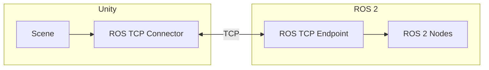

# 2.2 Unity for Human-Robot Interaction

> *"Unity brings photorealism to robotics—essential for training vision models and testing HRI."*

---

## Learning Objectives

- Set up Unity with ROS 2 communication
- Create photorealistic environments for HRI
- Implement human avatars for interaction testing
- Generate synthetic training data

---

## Why Unity for Robotics?

| Feature | Benefit |
|---------|---------|
| **Photorealistic Rendering** | Train vision models on realistic images |
| **Human Animation** | Test human-robot interaction scenarios |
| **Cross-Platform** | Deploy to VR, AR, desktop |
| **Asset Ecosystem** | Thousands of ready-made environments |

---

## Unity-ROS 2 Integration



### Installation

```bash
# ROS 2 side: Install TCP endpoint
sudo apt install ros-humble-ros-tcp-endpoint

# Start endpoint
ros2 run ros_tcp_endpoint default_server_endpoint --ros-args -p ROS_IP:=0.0.0.0
```

**Unity Package Manager:**
1. Window → Package Manager
2. Add package from git URL:
   `https://github.com/Unity-Technologies/ROS-TCP-Connector.git?path=/com.unity.robotics.ros-tcp-connector`

---

## Creating an HRI Environment

### C# Script: ROS Publisher

```csharp
using UnityEngine;
using Unity.Robotics.ROSTCPConnector;
using RosMessageTypes.Geometry;

public class RobotPositionPublisher : MonoBehaviour
{
    ROSConnection ros;
    public string topicName = "unity/robot_pose";
    public GameObject robot;
    public float publishFrequency = 10f;
    
    private float timeElapsed;
    
    void Start()
    {
        ros = ROSConnection.GetOrCreateInstance();
        ros.RegisterPublisher<PoseStampedMsg>(topicName);
    }
    
    void Update()
    {
        timeElapsed += Time.deltaTime;
        
        if (timeElapsed >= 1f / publishFrequency)
        {
            PublishPose();
            timeElapsed = 0;
        }
    }
    
    void PublishPose()
    {
        var pose = new PoseStampedMsg
        {
            header = new HeaderMsg
            {
                frame_id = "world",
                stamp = new TimeMsg
                {
                    sec = (int)Time.time,
                    nanosec = (uint)((Time.time % 1) * 1e9)
                }
            },
            pose = new PoseMsg
            {
                position = new PointMsg
                {
                    x = robot.transform.position.z,  // Unity Z = ROS X
                    y = -robot.transform.position.x, // Unity X = -ROS Y
                    z = robot.transform.position.y   // Unity Y = ROS Z
                },
                orientation = new QuaternionMsg
                {
                    x = robot.transform.rotation.z,
                    y = -robot.transform.rotation.x,
                    z = robot.transform.rotation.y,
                    w = robot.transform.rotation.w
                }
            }
        };
        
        ros.Publish(topicName, pose);
    }
}
```

:::danger Coordinate Frames
Unity uses left-handed Y-up coordinates. ROS uses right-handed Z-up. Always transform between them!
:::

---

### C# Script: Command Subscriber

```csharp
using UnityEngine;
using Unity.Robotics.ROSTCPConnector;
using RosMessageTypes.Geometry;

public class RobotController : MonoBehaviour
{
    public float moveSpeed = 2f;
    public float turnSpeed = 90f;
    
    private Vector3 targetVelocity;
    private float targetAngular;
    
    void Start()
    {
        ROSConnection.GetOrCreateInstance()
            .Subscribe<TwistMsg>("cmd_vel", OnCmdVelReceived);
    }
    
    void OnCmdVelReceived(TwistMsg msg)
    {
        // Convert ROS velocities to Unity
        targetVelocity = new Vector3(
            -(float)msg.linear.y,  // ROS Y -> Unity -X
            0,
            (float)msg.linear.x    // ROS X -> Unity Z
        );
        targetAngular = -(float)msg.angular.z * Mathf.Rad2Deg;
    }
    
    void FixedUpdate()
    {
        // Apply movement
        transform.Translate(targetVelocity * moveSpeed * Time.fixedDeltaTime);
        transform.Rotate(0, targetAngular * Time.fixedDeltaTime, 0);
    }
}
```

---

## Human Avatar Integration

For HRI testing, add animated human characters:

```csharp
public class HumanBehavior : MonoBehaviour
{
    public Transform robot;
    public float personalSpaceRadius = 1.5f;
    public float walkSpeed = 1.2f;
    
    private Animator animator;
    private NavMeshAgent agent;
    
    void Start()
    {
        animator = GetComponent<Animator>();
        agent = GetComponent<NavMeshAgent>();
    }
    
    void Update()
    {
        float distanceToRobot = Vector3.Distance(
            transform.position, 
            robot.position
        );
        
        // React to robot proximity
        if (distanceToRobot < personalSpaceRadius)
        {
            // Step back
            Vector3 awayFromRobot = (transform.position - robot.position).normalized;
            agent.SetDestination(transform.position + awayFromRobot * 2f);
            animator.SetBool("IsNervous", true);
        }
        else
        {
            animator.SetBool("IsNervous", false);
        }
    }
}
```

---

## Synthetic Data Generation

```csharp
public class DataGenerator : MonoBehaviour
{
    public Camera captureCamera;
    public int imageWidth = 640;
    public int imageHeight = 480;
    
    public void CaptureFrame(string filename)
    {
        RenderTexture rt = new RenderTexture(imageWidth, imageHeight, 24);
        captureCamera.targetTexture = rt;
        
        Texture2D screenshot = new Texture2D(imageWidth, imageHeight, TextureFormat.RGB24, false);
        captureCamera.Render();
        
        RenderTexture.active = rt;
        screenshot.ReadPixels(new Rect(0, 0, imageWidth, imageHeight), 0, 0);
        screenshot.Apply();
        
        byte[] bytes = screenshot.EncodeToPNG();
        System.IO.File.WriteAllBytes(filename, bytes);
        
        captureCamera.targetTexture = null;
        RenderTexture.active = null;
        Destroy(rt);
    }
}
```

---

## Exercises

### Exercise 2.2.1: Living Room Scene
Create a living room environment with furniture and spawn your robot.

### Exercise 2.2.2: Human Crowds
Add multiple human avatars with random walking patterns.

### Exercise 2.2.3: Sensor Visualization
Display LiDAR rays in Unity using LineRenderer components.

---

<div style={{textAlign: 'center', marginTop: '2rem'}}>

[← Previous: Physics Engines](./physics-engines.md) | [Next: Sensor Simulation →](./sensor-simulation.md)

</div>
