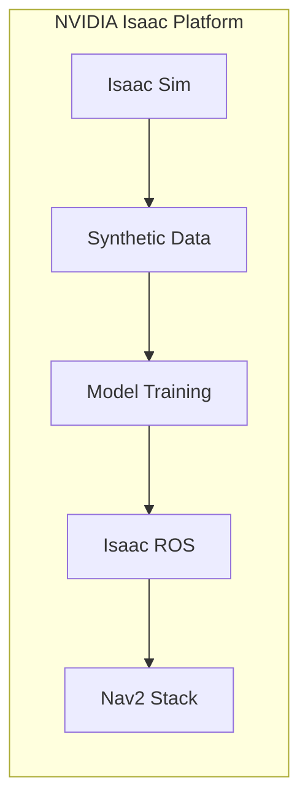
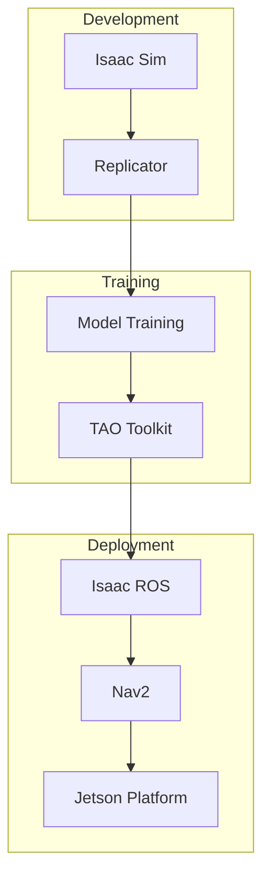

# Module 3: The AI-Robot Brain

> *"Isaac is the cerebral cortex of modern robotics—where perception meets cognition meets action."*

---



---

## 🎯 Module Objectives

By the end of this module, you will be able to:

- **Generate** synthetic training data using Isaac Sim
- **Implement** Visual SLAM for mapping and localization
- **Configure** Nav2 stacks for bipedal path planning
- **Build** a robot that maps a room and navigates autonomously

---

## 📚 Chapter Overview

| Chapter | Topic | Deliverable |
|---------|-------|-------------|
| 3.1 | [Isaac Sim & Synthetic Data](./isaac-sim.md) | Training dataset |
| 3.2 | [Visual SLAM & Mapping](./visual-slam.md) | Room map |
| 3.3 | [Nav2 Navigation](./nav2-navigation.md) | Point A to B navigation |

---

## The NVIDIA Isaac Ecosystem



---

## Prerequisites

```bash
# System requirements
# - Ubuntu 22.04
# - NVIDIA GPU with 8GB+ VRAM
# - NVIDIA Driver 525+
# - Docker with NVIDIA Container Toolkit

# Install Isaac ROS
mkdir -p ~/isaac_ros_ws/src
cd ~/isaac_ros_ws/src
git clone https://github.com/NVIDIA-ISAAC-ROS/isaac_ros_common.git

# Build container
cd ~/isaac_ros_ws/src/isaac_ros_common
./scripts/run_dev.sh
```

:::danger Hardware Requirements
Isaac Sim requires a powerful GPU (RTX 3070+). For CPUs or integrated graphics, use the Isaac ROS packages only, without Isaac Sim.
:::

---

## 📦 Deliverables

By completing this module, you will have:

1. **Synthetic Dataset** - Training images with ground truth
2. **SLAM Map** - Occupancy grid of a room
3. **Autonomous Navigation** - Robot moving from A to B

---

## 📥 Code Downloads

Download the complete code examples for this module:

import CodeDownloads from '@site/src/components/CodeDownloads';

<CodeDownloads
    module={3}
    files={[
        { filename: 'slam_node.py', description: 'Visual SLAM implementation' },
        { filename: 'nav2_params.yaml', description: 'Nav2 stack configuration' }
    ]}
/>

---

<div style={{textAlign: 'center', marginTop: '2rem'}}>

[Start Chapter 3.1: Isaac Sim →](./isaac-sim.md)

</div>

