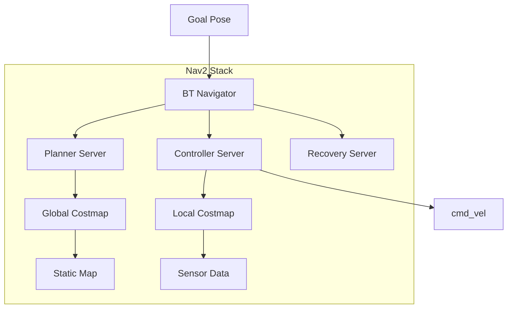

# 3.3 Nav2 Navigation

> *"Navigation is the art of getting from here to there—while avoiding everything in between."*

---

## Learning Objectives

- Configure Nav2 for humanoid robot navigation
- Set up costmaps for obstacle avoidance
- Implement behavior trees for navigation logic
- Create the A-to-B navigation deliverable

---

## Nav2 Architecture



---

## Nav2 Installation

```bash
# Install Nav2
sudo apt install ros-humble-navigation2 ros-humble-nav2-bringup

# Install dependencies
sudo apt install ros-humble-slam-toolbox ros-humble-robot-localization
```

---

## Nav2 Parameters Configuration

```yaml
# config/nav2_params.yaml
bt_navigator:
  ros__parameters:
    global_frame: map
    robot_base_frame: base_link
    odom_topic: /odom
    default_nav_to_pose_bt_xml: navigate_to_pose_w_replanning_and_recovery.xml
    plugin_lib_names:
      - nav2_compute_path_to_pose_action_bt_node
      - nav2_follow_path_action_bt_node
      - nav2_back_up_action_bt_node
      - nav2_spin_action_bt_node
      - nav2_wait_action_bt_node

controller_server:
  ros__parameters:
    controller_frequency: 20.0
    min_x_velocity_threshold: 0.001
    min_y_velocity_threshold: 0.5
    min_theta_velocity_threshold: 0.001
    progress_checker_plugin: "progress_checker"
    goal_checker_plugin: "goal_checker"
    controller_plugins: ["FollowPath"]
    
    progress_checker:
      plugin: "nav2_controller::SimpleProgressChecker"
      required_movement_radius: 0.5
      movement_time_allowance: 10.0
    
    goal_checker:
      plugin: "nav2_controller::SimpleGoalChecker"
      xy_goal_tolerance: 0.25
      yaw_goal_tolerance: 0.25
      stateful: True
    
    FollowPath:
      plugin: "dwb_core::DWBLocalPlanner"
      debug_trajectory_details: True
      min_vel_x: 0.0
      min_vel_y: 0.0
      max_vel_x: 0.5
      max_vel_y: 0.0  # Non-holonomic
      max_vel_theta: 1.0
      min_speed_xy: 0.0
      max_speed_xy: 0.5
      min_speed_theta: 0.0
      acc_lim_x: 2.5
      acc_lim_y: 0.0
      acc_lim_theta: 3.2
      decel_lim_x: -2.5
      decel_lim_y: 0.0
      decel_lim_theta: -3.2

planner_server:
  ros__parameters:
    planner_plugins: ["GridBased"]
    GridBased:
      plugin: "nav2_navfn_planner/NavfnPlanner"
      tolerance: 0.5
      use_astar: false
      allow_unknown: true

local_costmap:
  local_costmap:
    ros__parameters:
      update_frequency: 5.0
      publish_frequency: 2.0
      global_frame: odom
      robot_base_frame: base_link
      rolling_window: true
      width: 3
      height: 3
      resolution: 0.05
      robot_radius: 0.3
      plugins: ["obstacle_layer", "inflation_layer"]
      
      obstacle_layer:
        plugin: "nav2_costmap_2d::ObstacleLayer"
        enabled: True
        observation_sources: scan
        scan:
          topic: /scan
          max_obstacle_height: 2.0
          clearing: True
          marking: True
          data_type: "LaserScan"
      
      inflation_layer:
        plugin: "nav2_costmap_2d::InflationLayer"
        cost_scaling_factor: 3.0
        inflation_radius: 0.55

global_costmap:
  global_costmap:
    ros__parameters:
      update_frequency: 1.0
      publish_frequency: 1.0
      global_frame: map
      robot_base_frame: base_link
      robot_radius: 0.3
      resolution: 0.05
      track_unknown_space: true
      plugins: ["static_layer", "obstacle_layer", "inflation_layer"]
      
      static_layer:
        plugin: "nav2_costmap_2d::StaticLayer"
        map_subscribe_transient_local: True
      
      obstacle_layer:
        plugin: "nav2_costmap_2d::ObstacleLayer"
        enabled: True
        observation_sources: scan
        scan:
          topic: /scan
          max_obstacle_height: 2.0
          clearing: True
          marking: True
      
      inflation_layer:
        plugin: "nav2_costmap_2d::InflationLayer"
        cost_scaling_factor: 3.0
        inflation_radius: 0.55
```

---

## Deliverable: A-to-B Navigation

```python
#!/usr/bin/env python3
"""
Autonomous Navigation Node - Navigate from Point A to Point B
Deliverable for Module 3
"""

import rclpy
from rclpy.node import Node
from rclpy.action import ActionClient
from nav2_msgs.action import NavigateToPose
from geometry_msgs.msg import PoseStamped, PoseWithCovarianceStamped
from action_msgs.msg import GoalStatus
import math


class AutonomousNavigator(Node):
    def __init__(self):
        super().__init__('autonomous_navigator')
        
        # Nav2 action client
        self.nav_client = ActionClient(
            self,
            NavigateToPose,
            'navigate_to_pose'
        )
        
        # Initial pose publisher (for AMCL)
        self.initial_pose_pub = self.create_publisher(
            PoseWithCovarianceStamped,
            'initialpose',
            10
        )
        
        # State
        self.current_goal = None
        self.navigation_complete = False
        
        self.get_logger().info('Autonomous Navigator initialized')
        self.get_logger().info('Waiting for Nav2 action server...')
        self.nav_client.wait_for_server()
        self.get_logger().info('Nav2 action server available!')
    
    def set_initial_pose(self, x: float, y: float, yaw: float):
        """Set initial robot pose for localization"""
        msg = PoseWithCovarianceStamped()
        msg.header.frame_id = 'map'
        msg.header.stamp = self.get_clock().now().to_msg()
        
        msg.pose.pose.position.x = x
        msg.pose.pose.position.y = y
        msg.pose.pose.orientation.z = math.sin(yaw / 2)
        msg.pose.pose.orientation.w = math.cos(yaw / 2)
        
        # Covariance (uncertainty)
        msg.pose.covariance = [0.25, 0.0, 0.0, 0.0, 0.0, 0.0,
                               0.0, 0.25, 0.0, 0.0, 0.0, 0.0,
                               0.0, 0.0, 0.0, 0.0, 0.0, 0.0,
                               0.0, 0.0, 0.0, 0.0, 0.0, 0.0,
                               0.0, 0.0, 0.0, 0.0, 0.0, 0.0,
                               0.0, 0.0, 0.0, 0.0, 0.0, 0.06]
        
        self.initial_pose_pub.publish(msg)
        self.get_logger().info(f'Set initial pose: ({x}, {y}, {yaw})')
    
    def navigate_to_pose(self, x: float, y: float, yaw: float = 0.0):
        """Send navigation goal"""
        goal_msg = NavigateToPose.Goal()
        goal_msg.pose = PoseStamped()
        goal_msg.pose.header.frame_id = 'map'
        goal_msg.pose.header.stamp = self.get_clock().now().to_msg()
        
        goal_msg.pose.pose.position.x = x
        goal_msg.pose.pose.position.y = y
        goal_msg.pose.pose.orientation.z = math.sin(yaw / 2)
        goal_msg.pose.pose.orientation.w = math.cos(yaw / 2)
        
        self.get_logger().info(f'Navigating to: ({x}, {y})')
        
        self.current_goal = self.nav_client.send_goal_async(
            goal_msg,
            feedback_callback=self.feedback_callback
        )
        self.current_goal.add_done_callback(self.goal_response_callback)
    
    def goal_response_callback(self, future):
        """Handle goal acceptance"""
        goal_handle = future.result()
        
        if not goal_handle.accepted:
            self.get_logger().error('Goal rejected!')
            return
        
        self.get_logger().info('Goal accepted!')
        result_future = goal_handle.get_result_async()
        result_future.add_done_callback(self.result_callback)
    
    def feedback_callback(self, feedback_msg):
        """Handle navigation feedback"""
        feedback = feedback_msg.feedback
        current_pose = feedback.current_pose.pose
        
        # Calculate distance to goal
        if hasattr(self, 'goal_x'):
            dist = math.sqrt(
                (self.goal_x - current_pose.position.x)**2 +
                (self.goal_y - current_pose.position.y)**2
            )
            self.get_logger().info(f'Distance remaining: {dist:.2f}m')
    
    def result_callback(self, future):
        """Handle navigation result"""
        result = future.result()
        status = result.status
        
        if status == GoalStatus.STATUS_SUCCEEDED:
            self.get_logger().info('🎉 Navigation succeeded!')
            self.navigation_complete = True
        elif status == GoalStatus.STATUS_ABORTED:
            self.get_logger().error('Navigation aborted!')
        elif status == GoalStatus.STATUS_CANCELED:
            self.get_logger().warn('Navigation canceled')
    
    def navigate_waypoints(self, waypoints: list):
        """Navigate through a series of waypoints"""
        for i, (x, y, yaw) in enumerate(waypoints):
            self.get_logger().info(f'Waypoint {i+1}/{len(waypoints)}')
            self.navigation_complete = False
            self.goal_x, self.goal_y = x, y
            self.navigate_to_pose(x, y, yaw)
            
            # Wait for completion
            while not self.navigation_complete:
                rclpy.spin_once(self, timeout_sec=0.1)
        
        self.get_logger().info('All waypoints completed!')


def main(args=None):
    rclpy.init(args=args)
    
    navigator = AutonomousNavigator()
    
    # Set initial pose (Point A)
    navigator.set_initial_pose(0.0, 0.0, 0.0)
    
    # Wait for localization to settle
    import time
    time.sleep(2.0)
    
    # Navigate to Point B
    navigator.navigate_to_pose(5.0, 3.0, 1.57)
    
    # Spin until complete
    while not navigator.navigation_complete:
        rclpy.spin_once(navigator)
    
    navigator.destroy_node()
    rclpy.shutdown()


if __name__ == '__main__':
    main()
```

---

## Launch File

```python
# launch/navigation.launch.py
from launch import LaunchDescription
from launch_ros.actions import Node
from launch.actions import IncludeLaunchDescription
from launch.launch_description_sources import PythonLaunchDescriptionSource
from ament_index_python.packages import get_package_share_directory
import os

def generate_launch_description():
    nav2_bringup_dir = get_package_share_directory('nav2_bringup')
    my_robot_dir = get_package_share_directory('my_robot_pkg')
    
    return LaunchDescription([
        # Nav2 bringup
        IncludeLaunchDescription(
            PythonLaunchDescriptionSource(
                os.path.join(nav2_bringup_dir, 'launch', 'bringup_launch.py')
            ),
            launch_arguments={
                'map': os.path.join(my_robot_dir, 'maps', 'room.yaml'),
                'params_file': os.path.join(my_robot_dir, 'config', 'nav2_params.yaml'),
                'use_sim_time': 'true'
            }.items()
        ),
        
        # Our navigation node
        Node(
            package='my_robot_pkg',
            executable='autonomous_navigator',
            name='autonomous_navigator',
            output='screen'
        )
    ])
```

---

## Testing Navigation

```bash
# Terminal 1: Launch Gazebo with robot
ros2 launch my_robot_pkg gazebo.launch.py

# Terminal 2: Launch Nav2
ros2 launch my_robot_pkg navigation.launch.py

# Terminal 3: Visualize in RViz
rviz2 -d $(ros2 pkg prefix nav2_bringup)/share/nav2_bringup/rviz/nav2_default_view.rviz

# Terminal 4: Send goal (alternative to code)
ros2 action send_goal /navigate_to_pose nav2_msgs/action/NavigateToPose \
  "{pose: {header: {frame_id: 'map'}, pose: {position: {x: 5.0, y: 3.0}}}}"
```

---

## Exercises

### Exercise 3.3.1: Waypoint Following
Implement a patrol behavior that continuously navigates between 4 waypoints.

### Exercise 3.3.2: Dynamic Obstacles
Test navigation with moving obstacles and tune the local costmap.

### Exercise 3.3.3: Custom Planner
Implement A* path planning as a custom Nav2 planner plugin.

---

<div style={{textAlign: 'center', marginTop: '2rem'}}>

[← Previous: Visual SLAM](./visual-slam.md) | [Next: Module 4 - Vision-Language-Action →](../04-vision-language-action/index.md)

</div>
