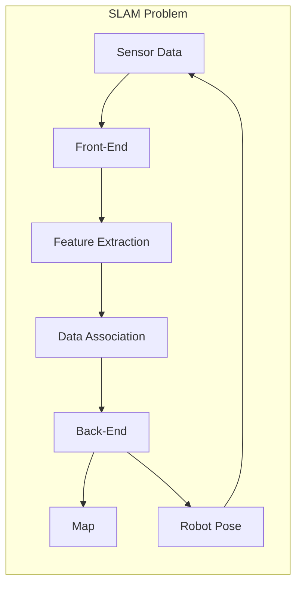
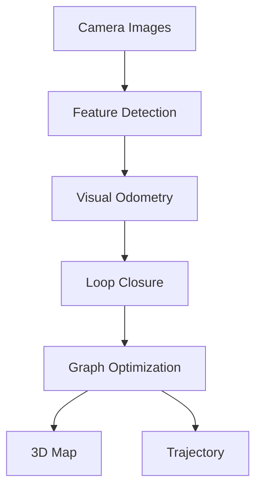

# 3.2 Visual SLAM & Mapping

> *"A robot without a map is like a human without memory—lost in a world it cannot understand."*

---

## 🎯 Learning Objectives

- Understand SLAM fundamentals (Simultaneous Localization and Mapping)
- Implement Visual SLAM using Isaac ROS
- Generate occupancy grid maps
- Evaluate mapping quality

---

## What is SLAM?



SLAM solves the chicken-and-egg problem:
- **Localization** requires a map
- **Mapping** requires knowing your location
- **SLAM** solves both simultaneously

---

## Visual SLAM Pipeline



---

## Isaac ROS Visual SLAM

### Installation

```bash
# Clone Isaac ROS packages
cd ~/isaac_ros_ws/src
git clone https://github.com/NVIDIA-ISAAC-ROS/isaac_ros_visual_slam.git
git clone https://github.com/NVIDIA-ISAAC-ROS/isaac_ros_image_pipeline.git

# Build
cd ~/isaac_ros_ws
colcon build --packages-select isaac_ros_visual_slam
source install/setup.bash
```

### Launch File

```python
# launch/vslam.launch.py
from launch import LaunchDescription
from launch_ros.actions import Node

def generate_launch_description():
    return LaunchDescription([
        Node(
            package='isaac_ros_visual_slam',
            executable='visual_slam_node',
            name='visual_slam',
            parameters=[{
                'denoise_input_images': True,
                'rectified_images': True,
                'enable_localization_n_mapping': True,
                'enable_imu_fusion': True,
                'gyro_noise_density': 0.000244,
                'gyro_random_walk': 0.000019,
                'accel_noise_density': 0.001862,
                'accel_random_walk': 0.003,
                'calibration_frequency': 200.0,
                'image_jitter_threshold_ms': 35.0
            }],
            remappings=[
                ('stereo_camera/left/image', '/camera/left/image_raw'),
                ('stereo_camera/left/camera_info', '/camera/left/camera_info'),
                ('stereo_camera/right/image', '/camera/right/image_raw'),
                ('stereo_camera/right/camera_info', '/camera/right/camera_info'),
                ('visual_slam/imu', '/imu/data')
            ]
        )
    ])
```

---

## Processing SLAM Output

```python
#!/usr/bin/env python3
"""
SLAM Map Processor - Convert point cloud to occupancy grid
"""

import rclpy
from rclpy.node import Node
from sensor_msgs.msg import PointCloud2
from nav_msgs.msg import OccupancyGrid
from geometry_msgs.msg import PoseStamped
import numpy as np
import sensor_msgs_py.point_cloud2 as pc2


class SLAMMapProcessor(Node):
    def __init__(self):
        super().__init__('slam_map_processor')
        
        # Parameters
        self.resolution = 0.05  # 5cm per cell
        self.map_size = 200     # 200x200 cells = 10x10 meters
        
        # Subscribers
        self.pointcloud_sub = self.create_subscription(
            PointCloud2,
            '/visual_slam/vis/landmarks_cloud',
            self.pointcloud_callback,
            10
        )
        
        self.pose_sub = self.create_subscription(
            PoseStamped,
            '/visual_slam/tracking/odometry',
            self.pose_callback,
            10
        )
        
        # Publishers
        self.map_pub = self.create_publisher(
            OccupancyGrid,
            '/map',
            10
        )
        
        # State
        self.occupancy_grid = np.full(
            (self.map_size, self.map_size), 
            -1,  # Unknown
            dtype=np.int8
        )
        self.robot_pose = None
        
        # Periodic map publishing
        self.timer = self.create_timer(1.0, self.publish_map)
        
        self.get_logger().info('SLAM Map Processor initialized')
    
    def pointcloud_callback(self, msg: PointCloud2):
        """Process landmark point cloud"""
        points = list(pc2.read_points(
            msg, 
            field_names=['x', 'y', 'z'],
            skip_nans=True
        ))
        
        for point in points:
            x, y, z = point
            
            # Filter points at ground level (obstacles)
            if 0.1 < z < 2.0:
                # Convert to grid coordinates
                grid_x = int((x / self.resolution) + self.map_size // 2)
                grid_y = int((y / self.resolution) + self.map_size // 2)
                
                if 0 <= grid_x < self.map_size and 0 <= grid_y < self.map_size:
                    self.occupancy_grid[grid_y, grid_x] = 100  # Occupied
    
    def pose_callback(self, msg: PoseStamped):
        """Track robot pose for free space raytracing"""
        self.robot_pose = msg.pose
        
        if self.robot_pose:
            # Mark current position as free
            x = self.robot_pose.position.x
            y = self.robot_pose.position.y
            
            grid_x = int((x / self.resolution) + self.map_size // 2)
            grid_y = int((y / self.resolution) + self.map_size // 2)
            
            # Mark robot footprint as free
            for dx in range(-2, 3):
                for dy in range(-2, 3):
                    gx, gy = grid_x + dx, grid_y + dy
                    if 0 <= gx < self.map_size and 0 <= gy < self.map_size:
                        if self.occupancy_grid[gy, gx] == -1:
                            self.occupancy_grid[gy, gx] = 0  # Free
    
    def publish_map(self):
        """Publish occupancy grid"""
        msg = OccupancyGrid()
        msg.header.stamp = self.get_clock().now().to_msg()
        msg.header.frame_id = 'map'
        
        msg.info.resolution = self.resolution
        msg.info.width = self.map_size
        msg.info.height = self.map_size
        msg.info.origin.position.x = -self.map_size * self.resolution / 2
        msg.info.origin.position.y = -self.map_size * self.resolution / 2
        
        msg.data = self.occupancy_grid.flatten().tolist()
        
        self.map_pub.publish(msg)
        self.get_logger().info('Published map')


def main(args=None):
    rclpy.init(args=args)
    node = SLAMMapProcessor()
    rclpy.spin(node)
    node.destroy_node()
    rclpy.shutdown()


if __name__ == '__main__':
    main()
```

---

## Map Saving and Loading

```python
from nav_msgs.srv import GetMap
import yaml
from PIL import Image
import numpy as np

class MapSaver:
    """Save occupancy grid to files"""
    
    def save_map(self, occupancy_grid: np.ndarray, 
                 resolution: float, 
                 origin: tuple,
                 filename: str):
        """Save map as PGM image and YAML metadata"""
        
        # Convert to image format
        # ROS uses: 0=free(white), 100=occupied(black), -1=unknown(gray)
        img_data = np.zeros_like(occupancy_grid, dtype=np.uint8)
        img_data[occupancy_grid == 0] = 254      # Free = white
        img_data[occupancy_grid == 100] = 0      # Occupied = black
        img_data[occupancy_grid == -1] = 205     # Unknown = gray
        
        # Save image
        img = Image.fromarray(img_data)
        img.save(f"{filename}.pgm")
        
        # Save metadata
        metadata = {
            'image': f"{filename}.pgm",
            'resolution': resolution,
            'origin': list(origin) + [0.0],
            'occupied_thresh': 0.65,
            'free_thresh': 0.196,
            'negate': 0
        }
        
        with open(f"{filename}.yaml", 'w') as f:
            yaml.dump(metadata, f)
        
        print(f"Map saved to {filename}.pgm and {filename}.yaml")
```

---

## Evaluating Map Quality

```python
def evaluate_map(ground_truth: np.ndarray, 
                 generated: np.ndarray) -> dict:
    """Evaluate SLAM map against ground truth"""
    
    # Only compare known cells
    known_gt = ground_truth != -1
    known_gen = generated != -1
    both_known = known_gt & known_gen
    
    if not np.any(both_known):
        return {'error': 'No overlapping known regions'}
    
    gt_known = ground_truth[both_known]
    gen_known = generated[both_known]
    
    # Metrics
    accuracy = np.mean(gt_known == gen_known)
    
    # Precision/Recall for obstacles
    true_positives = np.sum((gt_known == 100) & (gen_known == 100))
    false_positives = np.sum((gt_known == 0) & (gen_known == 100))
    false_negatives = np.sum((gt_known == 100) & (gen_known == 0))
    
    precision = true_positives / (true_positives + false_positives + 1e-6)
    recall = true_positives / (true_positives + false_negatives + 1e-6)
    f1 = 2 * precision * recall / (precision + recall + 1e-6)
    
    return {
        'accuracy': accuracy,
        'precision': precision,
        'recall': recall,
        'f1_score': f1,
        'coverage': np.mean(known_gen)
    }
```

---

## 📝 Exercises

### Exercise 3.2.1: Loop Closure
Implement a simple loop closure detector using image similarity.

### Exercise 3.2.2: Multi-Floor Mapping
Extend the map processor to handle 3D occupancy grids (voxels).

### Exercise 3.2.3: Dynamic Objects
Filter out moving objects from the SLAM landmark cloud.

---

<div style={{textAlign: 'center', marginTop: '2rem'}}>

[← Previous: Isaac Sim](./isaac-sim.md) | [Next: Nav2 Navigation →](./nav2-navigation.md)

</div>
