# 4.3 Capstone: The Autonomous Humanoid

> *"This is where everything comes together—the culmination of your Physical AI journey."*

---

## 🎯 Capstone Objectives

Build a complete system where:

1. 🎤 **Voice Command**: User speaks naturally to the robot
2. 🧠 **Understanding**: LLM parses intent and plans actions
3. 🗺️ **Navigation**: Robot moves to target location
4. 📷 **Perception**: Vision system identifies objects
5. 🤖 **Manipulation**: Robot interacts with the world
6. 🔊 **Feedback**: Robot confirms actions verbally

---

## System Architecture

```mermaid
graph TB
    subgraph "Input Layer"
        MIC[🎤 Microphone] --> WHISPER[Whisper ASR]
        CAM[📷 Camera] --> VISION[Vision Pipeline]
    end
    
    subgraph "Cognition Layer"
        WHISPER --> ORCHESTRATOR[VLA Orchestrator]
        VISION --> ORCHESTRATOR
        ORCHESTRATOR --> LLM[Claude/GPT-4]
        LLM --> PLANNER[Task Planner]
    end
    
    subgraph "Action Layer"
        PLANNER --> NAV[Nav2 Navigation]
        PLANNER --> MANIP[Manipulation]
        PLANNER --> TTS[Text-to-Speech]
    end
    
    subgraph "Feedback"
        NAV --> ORCHESTRATOR
        MANIP --> ORCHESTRATOR
        TTS --> SPEAKER[🔊 Speaker]
    end
```



---

## 🚀 Complete VLA System

```python
#!/usr/bin/env python3
"""
The Autonomous Humanoid - Complete VLA System
Capstone Deliverable for Physical AI & Humanoid Robotics
"""

import rclpy
from rclpy.node import Node
from rclpy.action import ActionClient
from rclpy.callback_groups import ReentrantCallbackGroup

from std_msgs.msg import String
from sensor_msgs.msg import Image
from geometry_msgs.msg import PoseStamped
from nav2_msgs.action import NavigateToPose

import whisper
import numpy as np
import sounddevice as sd
import json
import os
import threading
import queue
from enum import Enum
from dataclasses import dataclass
from typing import Optional, List
from anthropic import Anthropic


class RobotState(Enum):
    IDLE = "idle"
    LISTENING = "listening"
    THINKING = "thinking"
    NAVIGATING = "navigating"
    MANIPULATING = "manipulating"
    SPEAKING = "speaking"
    ERROR = "error"


@dataclass
class ActionResult:
    success: bool
    message: str
    data: Optional[dict] = None


class AutonomousHumanoid(Node):
    """
    The Autonomous Humanoid - Capstone VLA System
    
    Integrates:
    - Whisper speech recognition
    - Claude/GPT-4 task planning
    - Nav2 navigation
    - Object detection
    - Text-to-speech feedback
    """
    
    # Location coordinates (would come from map in real system)
    LOCATIONS = {
        "kitchen": {"x": 5.0, "y": 2.0, "yaw": 0.0},
        "living_room": {"x": 0.0, "y": 0.0, "yaw": 0.0},
        "bedroom": {"x": -3.0, "y": 4.0, "yaw": 1.57},
        "office": {"x": 2.0, "y": -3.0, "yaw": -1.57},
        "bathroom": {"x": -2.0, "y": -2.0, "yaw": 3.14}
    }
    
    def __init__(self):
        super().__init__('autonomous_humanoid')
        
        self.callback_group = ReentrantCallbackGroup()
        
        # ===== State =====
        self.state = RobotState.IDLE
        self.current_location = "living_room"
        self.holding = None
        self.action_queue: List[dict] = []
        
        # ===== Speech Recognition (Whisper) =====
        self.get_logger().info('Loading Whisper model...')
        self.whisper_model = whisper.load_model("base")
        self.audio_queue = queue.Queue()
        self.sample_rate = 16000
        self.wake_word = "robot"
        
        # ===== LLM Client =====
        api_key = os.environ.get("ANTHROPIC_API_KEY")
        if api_key:
            self.llm_client = Anthropic(api_key=api_key)
        else:
            self.get_logger().warn("No API key - using mock LLM")
            self.llm_client = None
        
        # ===== ROS 2 Interfaces =====
        
        # Navigation
        self.nav_client = ActionClient(
            self, NavigateToPose, 'navigate_to_pose',
            callback_group=self.callback_group
        )
        
        # Publishers
        self.speech_output_pub = self.create_publisher(
            String, 'speech/output', 10
        )
        self.status_pub = self.create_publisher(
            String, 'robot/status', 10
        )
        
        # Subscribers
        self.camera_sub = self.create_subscription(
            Image, '/camera/image_raw', self.camera_callback,
            10, callback_group=self.callback_group
        )
        
        # ===== Start Audio Thread =====
        self.running = True
        self.audio_thread = threading.Thread(target=self._audio_loop)
        self.audio_thread.daemon = True
        self.audio_thread.start()
        
        # ===== Main Processing Timer =====
        self.timer = self.create_timer(
            0.1, self.process_loop, callback_group=self.callback_group
        )
        
        self.get_logger().info('🤖 Autonomous Humanoid initialized!')
        self.get_logger().info(f'   Say "{self.wake_word}" followed by a command')
        self.speak("Hello! I am ready. Say robot followed by your command.")
    
    # ========== SPEECH RECOGNITION ==========
    
    def _audio_loop(self):
        """Continuous audio capture and transcription"""
        chunk_duration = 3.0
        chunk_samples = int(self.sample_rate * chunk_duration)
        
        while self.running:
            try:
                # Record audio
                audio = sd.rec(
                    chunk_samples,
                    samplerate=self.sample_rate,
                    channels=1,
                    dtype=np.float32
                )
                sd.wait()
                
                # Check energy level
                energy = np.mean(np.abs(audio))
                if energy > 0.01:
                    # Transcribe
                    result = self.whisper_model.transcribe(
                        audio.flatten(),
                        fp16=False,
                        language='en'
                    )
                    text = result["text"].strip().lower()
                    
                    if text and self.wake_word in text:
                        # Extract command
                        parts = text.split(self.wake_word, 1)
                        if len(parts) > 1 and parts[1].strip():
                            self.audio_queue.put(parts[1].strip())
                            
            except Exception as e:
                self.get_logger().error(f'Audio error: {e}')
    
    # ========== LLM TASK PLANNING ==========
    
    def plan_actions(self, command: str) -> List[dict]:
        """Convert natural language to action sequence"""
        
        system_prompt = """You are a robot task planner. Convert commands to action sequences.

Available actions:
- navigate: {"action": "navigate", "location": "kitchen/living_room/bedroom/office/bathroom"}
- pick: {"action": "pick", "object": "cup/book/etc"}
- place: {"action": "place", "location": "table/counter/etc"}
- speak: {"action": "speak", "text": "message"}
- look: {"action": "look", "object": "what to find"}

Current state:
- Location: {location}
- Holding: {holding}

Respond with JSON array only. Example:
[{"action": "navigate", "location": "kitchen"}, {"action": "speak", "text": "I am in the kitchen"}]
"""
        
        system = system_prompt.format(
            location=self.current_location,
            holding=self.holding or "nothing"
        )
        
        if self.llm_client:
            try:
                response = self.llm_client.messages.create(
                    model="claude-3-5-sonnet-20241022",
                    max_tokens=500,
                    system=system,
                    messages=[{"role": "user", "content": command}]
                )
                return json.loads(response.content[0].text)
            except Exception as e:
                self.get_logger().error(f'LLM error: {e}')
                return []
        else:
            # Mock response for testing
            return [
                {"action": "speak", "text": f"I heard: {command}"},
                {"action": "navigate", "location": "kitchen"}
            ]
    
    # ========== ACTION EXECUTION ==========
    
    def execute_action(self, action: dict) -> ActionResult:
        """Execute a single action"""
        action_type = action.get("action")
        
        if action_type == "navigate":
            return self.execute_navigation(action.get("location"))
        elif action_type == "speak":
            return self.execute_speak(action.get("text"))
        elif action_type == "pick":
            return self.execute_pick(action.get("object"))
        elif action_type == "place":
            return self.execute_place(action.get("location"))
        elif action_type == "look":
            return self.execute_look(action.get("object"))
        else:
            return ActionResult(False, f"Unknown action: {action_type}")
    
    def execute_navigation(self, location: str) -> ActionResult:
        """Navigate to a location"""
        if location not in self.LOCATIONS:
            return ActionResult(False, f"Unknown location: {location}")
        
        self.state = RobotState.NAVIGATING
        self.speak(f"Navigating to {location}")
        
        coords = self.LOCATIONS[location]
        
        # Create goal
        goal = NavigateToPose.Goal()
        goal.pose = PoseStamped()
        goal.pose.header.frame_id = 'map'
        goal.pose.header.stamp = self.get_clock().now().to_msg()
        goal.pose.pose.position.x = coords["x"]
        goal.pose.pose.position.y = coords["y"]
        
        import math
        goal.pose.pose.orientation.z = math.sin(coords["yaw"] / 2)
        goal.pose.pose.orientation.w = math.cos(coords["yaw"] / 2)
        
        # Send goal
        if self.nav_client.wait_for_server(timeout_sec=5.0):
            future = self.nav_client.send_goal_async(goal)
            rclpy.spin_until_future_complete(self, future, timeout_sec=60.0)
            
            self.current_location = location
            self.state = RobotState.IDLE
            return ActionResult(True, f"Arrived at {location}")
        else:
            self.state = RobotState.ERROR
            return ActionResult(False, "Navigation server not available")
    
    def execute_speak(self, text: str) -> ActionResult:
        """Speak a message"""
        self.speak(text)
        return ActionResult(True, f"Said: {text}")
    
    def execute_pick(self, obj: str) -> ActionResult:
        """Pick up an object (simulated)"""
        self.state = RobotState.MANIPULATING
        self.speak(f"Picking up {obj}")
        
        # Simulate pickup
        import time
        time.sleep(2.0)
        
        self.holding = obj
        self.state = RobotState.IDLE
        return ActionResult(True, f"Picked up {obj}")
    
    def execute_place(self, location: str) -> ActionResult:
        """Place held object"""
        if not self.holding:
            return ActionResult(False, "Not holding anything")
        
        self.state = RobotState.MANIPULATING
        self.speak(f"Placing {self.holding} on {location}")
        
        import time
        time.sleep(2.0)
        
        placed = self.holding
        self.holding = None
        self.state = RobotState.IDLE
        return ActionResult(True, f"Placed {placed} on {location}")
    
    def execute_look(self, obj: str) -> ActionResult:
        """Look for an object"""
        self.speak(f"Looking for {obj}")
        
        # Simulate detection
        import time
        time.sleep(1.0)
        
        # In real system, this would use vision
        found = True  # Simulated
        if found:
            return ActionResult(True, f"Found {obj}", {"location": "center"})
        else:
            return ActionResult(False, f"Could not find {obj}")
    
    # ========== SPEECH OUTPUT ==========
    
    def speak(self, text: str):
        """Publish text-to-speech message"""
        msg = String()
        msg.data = text
        self.speech_output_pub.publish(msg)
        self.get_logger().info(f'🔊 {text}')
    
    # ========== CAMERA CALLBACK ==========
    
    def camera_callback(self, msg: Image):
        """Process camera images for object detection"""
        # Would integrate with vision pipeline
        pass
    
    # ========== MAIN PROCESSING LOOP ==========
    
    def process_loop(self):
        """Main processing loop"""
        
        # Check for new voice commands
        if not self.audio_queue.empty() and self.state == RobotState.IDLE:
            command = self.audio_queue.get()
            self.get_logger().info(f'📢 Command: "{command}"')
            
            self.state = RobotState.THINKING
            self.speak(f"Processing: {command}")
            
            # Plan actions
            actions = self.plan_actions(command)
            self.action_queue = actions
            
            self.state = RobotState.IDLE
        
        # Execute queued actions
        if self.action_queue and self.state == RobotState.IDLE:
            action = self.action_queue.pop(0)
            result = self.execute_action(action)
            
            if not result.success:
                self.get_logger().error(f'Action failed: {result.message}')
                self.speak(f"I encountered a problem: {result.message}")
                self.action_queue.clear()
        
        # Publish status
        status = String()
        status.data = json.dumps({
            "state": self.state.value,
            "location": self.current_location,
            "holding": self.holding,
            "queue_length": len(self.action_queue)
        })
        self.status_pub.publish(status)
    
    def shutdown(self):
        """Clean shutdown"""
        self.running = False
        self.speak("Shutting down. Goodbye!")


def main(args=None):
    rclpy.init(args=args)
    
    robot = AutonomousHumanoid()
    
    try:
        rclpy.spin(robot)
    except KeyboardInterrupt:
        robot.shutdown()
    finally:
        robot.destroy_node()
        rclpy.shutdown()


if __name__ == '__main__':
    main()
```

---

## Running the Capstone

```bash
# Terminal 1: Launch simulation
ros2 launch my_robot_pkg full_simulation.launch.py

# Terminal 2: Launch navigation
ros2 launch my_robot_pkg navigation.launch.py

# Terminal 3: Run the Autonomous Humanoid
export ANTHROPIC_API_KEY="your-api-key"
ros2 run my_robot_pkg autonomous_humanoid

# Terminal 4: Monitor status
ros2 topic echo /robot/status
```

---

## Example Interactions

```
👤 User: "Robot, go to the kitchen and get me a cup"

🤖 Robot: "Processing: go to the kitchen and get me a cup"
🤖 Robot: "Navigating to kitchen"
   [Robot moves to kitchen]
🤖 Robot: "Looking for cup"
   [Camera detects cup]
🤖 Robot: "Picking up cup"
   [Gripper closes]
🤖 Robot: "I have picked up the cup. What would you like me to do with it?"

👤 User: "Robot, bring it to the living room"

🤖 Robot: "Navigating to living room"
   [Robot navigates while holding cup]
🤖 Robot: "I'm in the living room with the cup"
```

---

## 🎉 Congratulations!

You have completed the **AI-Native Textbook on Physical AI & Humanoid Robotics**!

### What You've Built

| Module | Deliverable |
|--------|-------------|
| **Module 1** | ROS 2 "Hello Robot" node + Bipedal URDF |
| **Module 2** | Gazebo simulation with sensor integration |
| **Module 3** | SLAM mapping + Nav2 navigation |
| **Module 4** | Complete VLA autonomous humanoid |

### Next Steps

1. 🔧 **Customize** - Adapt the system for your specific robot
2. 🧪 **Experiment** - Try different LLM prompts and behaviors
3. 🚀 **Deploy** - Move from simulation to real hardware
4. 🤝 **Contribute** - Share your improvements with the community

---

## 📚 Additional Resources

- [ROS 2 Documentation](https://docs.ros.org/en/humble/)
- [NVIDIA Isaac Documentation](https://developer.nvidia.com/isaac-ros)
- [Nav2 Documentation](https://navigation.ros.org/)
- [OpenAI Whisper](https://github.com/openai/whisper)
- [Anthropic Claude](https://docs.anthropic.com/)

---

<div style={{textAlign: 'center', marginTop: '3rem', padding: '2rem', background: 'linear-gradient(135deg, rgba(0,212,255,0.1), rgba(124,58,237,0.1))', borderRadius: '16px'}}>

### 🤖 You are now a Physical AI Engineer!

The future of human-robot collaboration is in your hands.

**Go build something amazing.**

[← Back to Course Introduction](/docs/intro)

</div>
