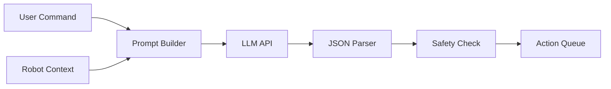

# 4.2 Cognitive Logic with LLMs

> *"LLMs are the universal translators between human intent and robot capability."*

---

## Learning Objectives

- Integrate LLMs for natural language understanding
- Design prompts for robot task decomposition
- Implement safety validation for generated actions
- Create a robust command parsing pipeline

---

## LLM Task Planning Architecture



---

## Setting Up LLM Integration

```python
import os
from anthropic import Anthropic
from openai import OpenAI

# Initialize clients
anthropic_client = Anthropic(api_key=os.environ.get("ANTHROPIC_API_KEY"))
openai_client = OpenAI(api_key=os.environ.get("OPENAI_API_KEY"))

def call_claude(prompt: str, system: str = "") -> str:
    """Call Claude API"""
    response = anthropic_client.messages.create(
        model="claude-3-5-sonnet-20241022",
        max_tokens=1024,
        system=system,
        messages=[{"role": "user", "content": prompt}]
    )
    return response.content[0].text

def call_gpt4(prompt: str, system: str = "") -> str:
    """Call GPT-4 API"""
    response = openai_client.chat.completions.create(
        model="gpt-4-turbo-preview",
        messages=[
            {"role": "system", "content": system},
            {"role": "user", "content": prompt}
        ]
    )
    return response.choices[0].message.content
```

---

## Robot Task Planner

```python
#!/usr/bin/env python3
"""
LLM-based Robot Task Planner
Converts natural language to action sequences
"""

import json
from dataclasses import dataclass
from typing import List, Optional
from enum import Enum


class ActionType(Enum):
    NAVIGATE = "navigate"
    PICK = "pick"
    PLACE = "place"
    SPEAK = "speak"
    WAIT = "wait"
    LOOK = "look"


@dataclass
class RobotAction:
    action_type: ActionType
    parameters: dict
    description: str


class RobotTaskPlanner:
    """
    Convert natural language commands to robot action sequences
    """
    
    SYSTEM_PROMPT = """You are a robot task planner. Convert user commands into structured action sequences.

Available actions:
- navigate: Move to a location. Parameters: {"location": "kitchen/bedroom/living_room/etc"}
- pick: Pick up an object. Parameters: {"object": "cup/book/etc", "color": "optional"}
- place: Place held object. Parameters: {"location": "table/shelf/etc"}
- speak: Say something. Parameters: {"text": "message"}
- wait: Wait for duration. Parameters: {"seconds": 5}
- look: Look for objects. Parameters: {"object": "what to find"}

Current robot capabilities:
- Can navigate to: kitchen, living_room, bedroom, bathroom, office
- Can pick up: small objects under 2kg
- Has camera for object detection
- Has speaker for audio output

Respond with JSON array of actions. Example:
[
  {"action": "navigate", "params": {"location": "kitchen"}, "description": "Going to kitchen"},
  {"action": "look", "params": {"object": "red cup"}, "description": "Looking for red cup"},
  {"action": "pick", "params": {"object": "cup", "color": "red"}, "description": "Picking up red cup"}
]

If a command is unsafe or impossible, respond with:
{"error": "explanation of why this cannot be done"}
"""
    
    def __init__(self, llm_client):
        self.llm = llm_client
        self.context = {
            "current_location": "living_room",
            "holding": None,
            "known_objects": [],
            "battery_level": 80
        }
    
    def update_context(self, key: str, value):
        """Update robot context"""
        self.context[key] = value
    
    def plan(self, command: str) -> List[RobotAction]:
        """
        Convert natural language command to action sequence
        """
        # Build prompt with context
        prompt = f"""
Current robot state:
- Location: {self.context['current_location']}
- Holding: {self.context['holding'] or 'nothing'}
- Battery: {self.context['battery_level']}%
- Known objects nearby: {', '.join(self.context['known_objects']) or 'none detected'}

User command: "{command}"

Generate the action sequence:
"""
        
        # Call LLM
        response = self.llm(prompt, self.SYSTEM_PROMPT)
        
        # Parse response
        try:
            actions_data = json.loads(response)
            
            # Check for error
            if isinstance(actions_data, dict) and "error" in actions_data:
                raise ValueError(actions_data["error"])
            
            # Convert to RobotAction objects
            actions = []
            for action_dict in actions_data:
                action = RobotAction(
                    action_type=ActionType(action_dict["action"]),
                    parameters=action_dict.get("params", {}),
                    description=action_dict.get("description", "")
                )
                actions.append(action)
            
            return actions
            
        except json.JSONDecodeError as e:
            raise ValueError(f"Failed to parse LLM response: {e}")
    
    def validate_actions(self, actions: List[RobotAction]) -> List[str]:
        """
        Validate action sequence for safety
        Returns list of warnings/errors
        """
        issues = []
        
        for i, action in enumerate(actions):
            # Check navigation targets
            if action.action_type == ActionType.NAVIGATE:
                valid_locations = ["kitchen", "living_room", "bedroom", 
                                   "bathroom", "office"]
                if action.parameters.get("location") not in valid_locations:
                    issues.append(
                        f"Action {i}: Unknown location '{action.parameters.get('location')}'"
                    )
            
            # Check pick constraints
            if action.action_type == ActionType.PICK:
                dangerous = ["knife", "scissors", "glass"]
                obj = action.parameters.get("object", "").lower()
                if any(d in obj for d in dangerous):
                    issues.append(
                        f"Action {i}: Potentially dangerous object '{obj}'"
                    )
        
        return issues


# Example usage
if __name__ == "__main__":
    # Mock LLM for testing
    def mock_llm(prompt, system):
        return json.dumps([
            {"action": "navigate", "params": {"location": "kitchen"}, 
             "description": "Going to kitchen"},
            {"action": "look", "params": {"object": "cup"}, 
             "description": "Looking for cup"},
            {"action": "pick", "params": {"object": "cup"}, 
             "description": "Picking up cup"}
        ])
    
    planner = RobotTaskPlanner(mock_llm)
    actions = planner.plan("Go to the kitchen and get me a cup")
    
    for action in actions:
        print(f"  {action.action_type.value}: {action.description}")
```

---

## Vision-Language Integration

```python
import base64
from pathlib import Path

class VisionLanguageProcessor:
    """
    Combine vision and language for grounded task planning
    """
    
    def __init__(self, openai_client):
        self.client = openai_client
    
    def analyze_scene(self, image_path: str, question: str) -> str:
        """
        Analyze image and answer question about it
        """
        # Encode image
        with open(image_path, "rb") as f:
            image_data = base64.b64encode(f.read()).decode()
        
        response = self.client.chat.completions.create(
            model="gpt-4-vision-preview",
            messages=[
                {
                    "role": "user",
                    "content": [
                        {
                            "type": "text",
                            "text": question
                        },
                        {
                            "type": "image_url",
                            "image_url": {
                                "url": f"data:image/jpeg;base64,{image_data}"
                            }
                        }
                    ]
                }
            ],
            max_tokens=300
        )
        
        return response.choices[0].message.content
    
    def find_object(self, image_path: str, object_name: str) -> dict:
        """
        Find object in image and return location
        """
        prompt = f"""
Look at this image and find the {object_name}.
Respond with JSON:
{{
    "found": true/false,
    "location": "left/center/right",
    "confidence": 0.0-1.0,
    "description": "brief description"
}}
"""
        response = self.analyze_scene(image_path, prompt)
        
        try:
            return json.loads(response)
        except:
            return {"found": False, "error": "Could not parse response"}
    
    def describe_scene(self, image_path: str) -> dict:
        """
        Get detailed scene description for context
        """
        prompt = """
Describe this scene from a robot's perspective. Include:
1. What room/area this appears to be
2. List of visible objects
3. Any people present
4. Potential obstacles
5. Clear paths for navigation

Respond as JSON with these keys: room, objects, people, obstacles, paths
"""
        response = self.analyze_scene(image_path, prompt)
        
        try:
            return json.loads(response)
        except:
            return {"description": response}
```

---

## ROS 2 Cognitive Node

```python
#!/usr/bin/env python3
"""
Cognitive Processing Node - LLM-based command interpretation
"""

import rclpy
from rclpy.node import Node
from std_msgs.msg import String
from geometry_msgs.msg import PoseStamped
import json
import os
from anthropic import Anthropic


class CognitiveNode(Node):
    def __init__(self):
        super().__init__('cognitive_processor')
        
        # Initialize LLM client
        api_key = os.environ.get("ANTHROPIC_API_KEY")
        if not api_key:
            self.get_logger().error("ANTHROPIC_API_KEY not set!")
            return
        
        self.client = Anthropic(api_key=api_key)
        
        # Subscribers
        self.command_sub = self.create_subscription(
            String, 'speech/command', self.command_callback, 10
        )
        
        # Publishers
        self.action_pub = self.create_publisher(String, 'robot/actions', 10)
        self.nav_goal_pub = self.create_publisher(PoseStamped, 'goal_pose', 10)
        self.speech_pub = self.create_publisher(String, 'speech/output', 10)
        
        # Robot context
        self.context = {
            "location": "home_base",
            "holding": None,
            "recent_commands": []
        }
        
        self.get_logger().info('Cognitive Processor ready')
    
    def command_callback(self, msg: String):
        """Process incoming voice command"""
        command = msg.data
        self.get_logger().info(f'Processing: "{command}"')
        
        # Add to history
        self.context["recent_commands"].append(command)
        self.context["recent_commands"] = self.context["recent_commands"][-5:]
        
        # Get action plan from LLM
        actions = self._plan_actions(command)
        
        if actions:
            # Publish action sequence
            action_msg = String()
            action_msg.data = json.dumps(actions)
            self.action_pub.publish(action_msg)
            
            # Confirm to user
            self._speak(f"I will {actions[0].get('description', 'execute your command')}")
    
    def _plan_actions(self, command: str) -> list:
        """Use LLM to plan actions"""
        try:
            response = self.client.messages.create(
                model="claude-3-5-sonnet-20241022",
                max_tokens=1024,
                system=RobotTaskPlanner.SYSTEM_PROMPT,
                messages=[{
                    "role": "user",
                    "content": f"Context: {json.dumps(self.context)}\nCommand: {command}"
                }]
            )
            
            return json.loads(response.content[0].text)
            
        except Exception as e:
            self.get_logger().error(f'LLM error: {e}')
            return []
    
    def _speak(self, text: str):
        """Publish speech output"""
        msg = String()
        msg.data = text
        self.speech_pub.publish(msg)


def main(args=None):
    rclpy.init(args=args)
    node = CognitiveNode()
    rclpy.spin(node)
    node.destroy_node()
    rclpy.shutdown()


if __name__ == '__main__':
    main()
```

---

## Exercises

### Exercise 4.2.1: Multi-Step Commands
Handle complex commands like "Make me coffee and bring it to the living room."

### Exercise 4.2.2: Clarification Dialogue
Implement follow-up questions when commands are ambiguous.

### Exercise 4.2.3: Error Recovery
Add error handling when actions fail mid-execution.

---

<div style={{textAlign: 'center', marginTop: '2rem'}}>

[← Previous: Voice Pipeline](./voice-pipeline.md) | [Next: Capstone Project →](./capstone.md)

</div>
