```mermaid
graph LR
    subgraph "VLA Pipeline"
        VOICE[🎤 Voice] --> ASR[Speech Recognition]
        ASR --> LLM[🧠 Language Model]
        VISION[📷 Vision] --> VLM[Vision-Language Model]
        VLM --> LLM
        LLM --> PLANNER[Task Planner]
        PLANNER --> ROS[ROS 2 Actions]
        ROS --> ROBOT[🤖 Robot]
    end
```

# Module 4: Vision-Language-Action (VLA)

> *"The ultimate goal: a robot that sees the world, understands your words, and acts with purpose."*

---



---

## 🎯 Module Objectives (Capstone)

This is the **capstone module** that integrates everything you've learned:

- **Integrate** OpenAI Whisper for voice command ingestion
- **Implement** LLM-based task parsing ("Clean the room" → action sequences)
- **Build** the complete VLA pipeline from voice to robot action
- **Deploy** "The Autonomous Humanoid" — voice-commanded robot system

---

## 📚 Chapter Overview

| Chapter | Topic | Deliverable |
|---------|-------|-------------|
| 4.1 | [Voice Pipeline (Whisper)](./voice-pipeline.md) | Speech-to-text system |
| 4.2 | [Cognitive Logic (LLMs)](./cognitive-logic.md) | Natural language to actions |
| 4.3 | [Capstone: Autonomous Humanoid](./capstone.md) | Complete VLA system |

---

## The VLA Revolution

**Vision-Language-Action (VLA)** models represent the frontier of robotics:

| Component | Technology | Function |
|-----------|------------|----------|
| **Vision** | ViT, CLIP, GPT-4V | Scene understanding |
| **Language** | GPT-4, Claude, LLaMA | Intent parsing, planning |
| **Action** | ROS 2, MoveIt, Nav2 | Physical execution |

---

## Architecture


---

## Prerequisites

```bash
# Install speech recognition
pip install openai-whisper sounddevice numpy

# Install LLM integration
pip install anthropic openai langchain

# Ensure ROS 2 packages are available
ros2 pkg list | grep nav2
```

:::tip API Keys
You'll need API keys for:
- **OpenAI** (Whisper, GPT-4)
- **Anthropic** (Claude) - Optional alternative
:::

---

## 📦 Capstone Deliverable

**"The Autonomous Humanoid"** — A complete workflow where:

1. 🎤 User speaks: *"Go to the kitchen and pick up the red cup"*
2. 🧠 LLM parses command into action sequence
3. 🗺️ Robot navigates to kitchen
4. 📷 Vision identifies the red cup
5. 🤖 Robot picks up the cup
6. 🔊 Robot confirms: *"I have picked up the red cup"*

---

## 📥 Code Downloads

Download the complete code examples for this module:

import CodeDownloads from '@site/src/components/CodeDownloads';

<CodeDownloads
    module={4}
    files={[
        { filename: 'whisper_ros_node.py', description: 'Whisper speech recognition ROS node' },
        { filename: 'llm_task_planner.py', description: 'LLM-based task planning & parsing' },
        { filename: 'vla_orchestrator.py', description: 'Complete VLA pipeline orchestrator' }
    ]}
/>

---

<div style={{textAlign: 'center', marginTop: '2rem'}}>

[Start Chapter 4.1: Voice Pipeline →](./voice-pipeline)

</div>

