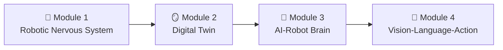

# 🤖 Physical AI & Humanoid Robotics

> *An AI-Native Textbook for Building Intelligent Robot Systems*

---

## Welcome to the Future of Robotics

This comprehensive curriculum teaches you to build **Physical AI systems**—intelligent robots that see, think, and act in the real world. Designed for **AI-assisted learning** with Claude Code & Agents, every chapter combines rigorous theory with deployable code.

---

## 📚 Curriculum Overview



---

### 🔌 [Module 1: The Robotic Nervous System](/docs/01-robotic-nervous-system/)

**Objective**: Establish the middleware foundation for robot control

| Chapter | Topic |
|---------|-------|
| 1.1 | ROS 2 Architecture: Nodes, Topics, Services |
| 1.2 | Python Bridging with rclpy |
| 1.3 | Anatomy of a Humanoid (URDF) |

**Deliverable**: "Hello Robot" node + Bipedal URDF model

---

### 🪞 [Module 2: The Digital Twin](/docs/02-digital-twin/)

**Objective**: Master physics simulation and environment building

| Chapter | Topic |
|---------|-------|
| 2.1 | Physics Engines (Gazebo) |
| 2.2 | Rendering & HRI (Unity) |
| 2.3 | Sensor Simulation |

**Deliverable**: Simulation with obstacle sensing

---

### 🧠 [Module 3: The AI-Robot Brain](/docs/03-ai-robot-brain/)

**Objective**: Implement advanced perception and navigation

| Chapter | Topic |
|---------|-------|
| 3.1 | Isaac Sim & Synthetic Data |
| 3.2 | Visual SLAM & Mapping |
| 3.3 | Nav2 Navigation |

**Deliverable**: Room mapping + A-to-B navigation

---

### 🎯 [Module 4: Vision-Language-Action (Capstone)](/docs/04-vision-language-action/)

**Objective**: Build the complete voice-to-action pipeline

| Chapter | Topic |
|---------|-------|
| 4.1 | Voice Pipeline (Whisper) |
| 4.2 | Cognitive Logic (LLMs) |
| 4.3 | Capstone: Autonomous Humanoid |

**Deliverable**: Voice-commanded autonomous humanoid

---

## 🛠️ Technology Stack

```yaml
Middleware:
  - ROS 2 Humble
  - rclpy (Python client)

Simulation:
  - Gazebo Fortress
  - Unity + ROS-TCP
  - NVIDIA Isaac Sim

AI/ML:
  - OpenAI Whisper (Speech)
  - Claude/GPT-4 (Planning)
  - PyTorch (Vision)

Navigation:
  - Nav2 Stack
  - Isaac ROS VSLAM
```

---

## 👥 Who Is This For?

| Background | Starting Point |
|------------|----------------|
| **Students** | Module 1, Chapter 1 |
| **Software Engineers** | Module 1, skim basics |
| **Robotics Engineers** | Module 3 or 4 |
| **AI/ML Engineers** | Module 3 and 4 |

### Prerequisites

- ✅ Basic Python programming
- ✅ Comfort with command line
- ✅ Understanding of basic CS concepts
- 🎯 Enthusiasm for robotics!

---

## 🚀 Getting Started

```bash
# 1. Install ROS 2
sudo apt install ros-humble-desktop

# 2. Create workspace
mkdir -p ~/ros2_ws/src && cd ~/ros2_ws

# 3. Clone course materials
git clone https://github.com/panaversity/pai-humanoid-code.git src/

# 4. Build and source
colcon build
source install/setup.bash

# 5. Verify installation
ros2 run demo_nodes_cpp talker
```

---

## 📖 How to Use This Textbook

:::tip AI-Assisted Learning
This textbook is designed for **AI-assisted learning**. Use Claude Code or GitHub Copilot alongside:

1. **Ask questions** about concepts you don't understand
2. **Debug code** with AI assistance
3. **Extend examples** with AI-generated modifications
:::

Each chapter includes:
- 🎯 **Learning Objectives** - What you'll master
- 📝 **Code Examples** - Working, tested implementations
- 🧪 **Exercises** - Practice problems
- ⚠️ **Callouts** - Critical safety and implementation notes

---

## 🤝 Community & Support

- 💬 **Discord**: [Panaversity Community](https://discord.gg/panaversity)
- 🐙 **GitHub**: [Course Repository](https://github.com/panaversity/ai-native-book)
- 📧 **Email**: support@panaversity.org

---

<div style={{textAlign: 'center', marginTop: '3rem'}}>

**Ready to build the future of robotics?**

[Start Module 1: Robotic Nervous System →](/docs/01-robotic-nervous-system/)

</div>
